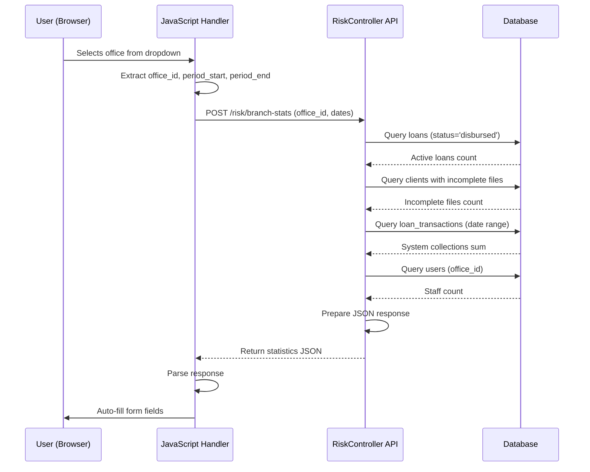

# Design Document: Audit Checklist Branch Statistics API

## Overview

This feature adds a new API endpoint to fetch branch-specific statistics when an office is selected from the audit checklist modal dropdown. The endpoint aggregates data from multiple database tables (loans, clients, loan_transactions, users) and returns JSON statistics that auto-fill specific fields in the audit checklist form. The implementation includes both backend API logic in Laravel PHP and frontend JavaScript to handle the AJAX call and form field population.

## Main Algorithm/Workflow



## Core Interfaces/Types

### PHP Request/Response Types

```php
// Request Parameters
interface BranchStatsRequest {
    office_id: int (required)
    period_start: string|null (optional, date format: Y-m-d)
    period_end: string|null (optional, date format: Y-m-d)
}

// Response Structure
interface BranchStatsResponse {
    success: bool
    data: {
        s3_total_active: int
        s3_incomplete_files: int
        s4_system_collections: float
        s4_wallet_collections: float
        s6_total_staff: int
    }
    message: string|null
}
```

### JavaScript Types

```javascript
// AJAX Request Data
interface AjaxRequestData {
    office_id: number
    period_start: string | null
    period_end: string | null
    _token: string
}

// AJAX Response Data
interface AjaxResponseData {
    success: boolean
    data: {
        s3_total_active: number
        s3_incomplete_files: number
        s4_system_collections: number
        s4_wallet_collections: number
        s6_total_staff: number
    }
    message?: string
}
```

## Key Functions with Formal Specifications

### Backend Function: getBranchStatistics()

```php
public function getBranchStatistics(Request $request): JsonResponse
```

**Preconditions:**
- `$request` contains validated `office_id` (integer, exists in offices table)
- `period_start` and `period_end` are valid date strings (Y-m-d format) or null
- User is authenticated and has permission to access risk management endpoints

**Postconditions:**
- Returns JsonResponse with status 200 on success
- Response contains all 5 required statistics fields
- If validation fails, returns JsonResponse with status 422
- If server error occurs, returns JsonResponse with status 500
- No database state is modified (read-only operation)

**Loop Invariants:** N/A (no explicit loops in main function, queries handled by Eloquent)

### Frontend Function: fetchBranchStatistics()

```javascript
function fetchBranchStatistics(officeId, periodStart, periodEnd)
```

**Preconditions:**
- `officeId` is a valid integer > 0
- `periodStart` and `periodEnd` are valid date strings or null
- CSRF token is available in the page
- jQuery and AJAX are loaded

**Postconditions:**
- AJAX request is sent to `/risk/branch-stats` endpoint
- On success: form fields are populated with returned data
- On error: error message is displayed to user
- Loading state is properly managed (show/hide indicators)

**Loop Invariants:** N/A (asynchronous callback-based flow)

### Frontend Function: populateStatisticsFields()

```javascript
function populateStatisticsFields(data)
```

**Preconditions:**
- `data` is a valid object containing all 5 statistics fields
- Target form fields exist in the DOM
- Field IDs match expected naming convention

**Postconditions:**
- All 5 form fields are populated with corresponding data values
- Numeric values are properly formatted
- Fields are marked as auto-filled (visual indicator if needed)

**Loop Invariants:** 
- For field population loop: All previously populated fields retain their values

## Algorithmic Pseudocode

### Main Backend Processing Algorithm

```php
ALGORITHM getBranchStatistics(request)
INPUT: request containing office_id, period_start, period_end
OUTPUT: JsonResponse with statistics or error

BEGIN
  // Step 1: Validate input
  ASSERT request.has('office_id') = true
  
  validator ← Validator.make(request.all(), [
    'office_id' => 'required|integer|exists:offices,id',
    'period_start' => 'nullable|date',
    'period_end' => 'nullable|date|after_or_equal:period_start'
  ])
  
  IF validator.fails() THEN
    RETURN JsonResponse({
      success: false,
      message: validator.errors().first()
    }, 422)
  END IF
  
  // Step 2: Extract validated parameters
  officeId ← request.input('office_id')
  periodStart ← request.input('period_start', null)
  periodEnd ← request.input('period_end', null)
  
  TRY
    // Step 3: Calculate each statistic
    totalActive ← calculateTotalActiveLoans(officeId)
    incompleteFiles ← calculateIncompleteFiles(officeId)
    systemCollections ← calculateSystemCollections(officeId, periodStart, periodEnd)
    walletCollections ← 0  // Placeholder for future implementation
    totalStaff ← calculateTotalStaff(officeId)
    
    // Step 4: Prepare response
    statistics ← {
      s3_total_active: totalActive,
      s3_incomplete_files: incompleteFiles,
      s4_system_collections: systemCollections,
      s4_wallet_collections: walletCollections,
      s6_total_staff: totalStaff
    }
    
    ASSERT statistics.s3_total_active >= 0
    ASSERT statistics.s3_incomplete_files >= 0
    ASSERT statistics.s4_system_collections >= 0
    ASSERT statistics.s6_total_staff >= 0
    
    RETURN JsonResponse({
      success: true,
      data: statistics
    }, 200)
    
  CATCH Exception e
    RETURN JsonResponse({
      success: false,
      message: 'Error fetching branch statistics: ' + e.getMessage()
    }, 500)
  END TRY
END
```

**Preconditions:**
- Request object is properly initialized
- Database connection is active
- All required tables exist (loans, clients, loan_transactions, users, offices)

**Postconditions:**
- Returns valid JSON response
- All statistics are non-negative integers or floats
- Response structure matches BranchStatsResponse interface

**Loop Invariants:** N/A (delegated to helper functions)

### Helper Algorithm: calculateTotalActiveLoans()

```php
ALGORITHM calculateTotalActiveLoans(officeId)
INPUT: officeId of type integer
OUTPUT: count of type integer

BEGIN
  ASSERT officeId > 0
  
  count ← DB.table('loans')
    .where('office_id', '=', officeId)
    .where('status', '=', 'disbursed')
    .whereNull('deleted_at')
    .count()
  
  ASSERT count >= 0
  
  RETURN count
END
```

**Preconditions:**
- `officeId` is a valid positive integer
- `loans` table exists with columns: office_id, status, deleted_at

**Postconditions:**
- Returns non-negative integer count
- Only counts loans with status='disbursed' and not soft-deleted
- No database modifications

**Loop Invariants:** N/A (single query execution)

### Helper Algorithm: calculateIncompleteFiles()

```php
ALGORITHM calculateIncompleteFiles(officeId)
INPUT: officeId of type integer
OUTPUT: count of type integer

BEGIN
  ASSERT officeId > 0
  
  // Define required fields that must not be empty
  requiredFields ← [
    'first_name', 'last_name', 'gender', 'dob',
    'mobile', 'address', 'city', 'province'
  ]
  
  // Build query to find clients with active loans and incomplete data
  query ← DB.table('clients')
    .join('loans', 'clients.id', '=', 'loans.client_id')
    .where('loans.office_id', '=', officeId)
    .where('loans.status', '=', 'disbursed')
    .whereNull('loans.deleted_at')
    .whereNull('clients.deleted_at')
  
  // Add conditions for empty/null fields
  FOR each field IN requiredFields DO
    query ← query.where(function(q) {
      q.whereNull('clients.' + field)
       .orWhere('clients.' + field, '=', '')
    }, null, null, 'or')
  END FOR
  
  count ← query.distinct('clients.id').count('clients.id')
  
  ASSERT count >= 0
  
  RETURN count
END
```

**Preconditions:**
- `officeId` is a valid positive integer
- `clients` and `loans` tables exist with proper relationships
- Required fields exist in clients table

**Postconditions:**
- Returns non-negative integer count
- Only counts distinct clients with at least one empty required field
- Only includes clients with active loans in the specified office

**Loop Invariants:**
- Query builder maintains valid SQL state throughout field condition additions
- All previously added field conditions remain in the query

### Helper Algorithm: calculateSystemCollections()

```php
ALGORITHM calculateSystemCollections(officeId, periodStart, periodEnd)
INPUT: officeId (integer), periodStart (string|null), periodEnd (string|null)
OUTPUT: total of type float

BEGIN
  ASSERT officeId > 0
  
  query ← DB.table('loan_transactions')
    .where('office_id', '=', officeId)
    .where('transaction_type', '=', 'repayment')
    .where('reversed', '=', 0)
    .whereNull('deleted_at')
  
  // Apply date range filter if provided
  IF periodStart IS NOT NULL THEN
    query ← query.where('date', '>=', periodStart)
  END IF
  
  IF periodEnd IS NOT NULL THEN
    query ← query.where('date', '<=', periodEnd)
  END IF
  
  total ← query.sum('credit') ?? 0.0
  
  ASSERT total >= 0
  
  RETURN total
END
```

**Preconditions:**
- `officeId` is a valid positive integer
- `periodStart` and `periodEnd` are valid date strings (Y-m-d) or null
- If both dates provided: periodEnd >= periodStart
- `loan_transactions` table exists with required columns

**Postconditions:**
- Returns non-negative float value
- Only sums non-reversed repayment transactions
- Respects date range if provided
- Returns 0.0 if no transactions found

**Loop Invariants:** N/A (single aggregation query)

### Helper Algorithm: calculateTotalStaff()

```php
ALGORITHM calculateTotalStaff(officeId)
INPUT: officeId of type integer
OUTPUT: count of type integer

BEGIN
  ASSERT officeId > 0
  
  count ← DB.table('users')
    .where('office_id', '=', officeId)
    .whereNull('deleted_at')
    .count()
  
  ASSERT count >= 0
  
  RETURN count
END
```

**Preconditions:**
- `officeId` is a valid positive integer
- `users` table exists with columns: office_id, deleted_at

**Postconditions:**
- Returns non-negative integer count
- Only counts non-deleted users
- No database modifications

**Loop Invariants:** N/A (single query execution)

### Frontend Algorithm: handleOfficeSelection()

```javascript
ALGORITHM handleOfficeSelection(event)
INPUT: event from office dropdown change
OUTPUT: void (side effects: AJAX call, form updates)

BEGIN
  // Step 1: Extract office ID
  selectedOfficeId ← event.target.value
  
  IF selectedOfficeId IS EMPTY THEN
    clearStatisticsFields()
    RETURN
  END IF
  
  ASSERT selectedOfficeId > 0
  
  // Step 2: Extract date range from form
  periodStart ← document.getElementById('s1_period_start').value
  periodEnd ← document.getElementById('s1_period_end').value
  
  // Step 3: Show loading indicator
  showLoadingIndicator()
  
  // Step 4: Prepare AJAX request
  requestData ← {
    office_id: selectedOfficeId,
    period_start: periodStart,
    period_end: periodEnd,
    _token: csrfToken
  }
  
  // Step 5: Make AJAX call
  $.ajax({
    url: '/risk/branch-stats',
    method: 'POST',
    data: requestData,
    dataType: 'json',
    success: function(response) {
      hideLoadingIndicator()
      
      IF response.success = true THEN
        populateStatisticsFields(response.data)
      ELSE
        showErrorMessage(response.message)
      END IF
    },
    error: function(xhr, status, error) {
      hideLoadingIndicator()
      showErrorMessage('Failed to fetch branch statistics. Please try again.')
    }
  })
END
```

**Preconditions:**
- Event is triggered by office dropdown change
- Required form fields exist in DOM
- CSRF token is available
- jQuery is loaded

**Postconditions:**
- AJAX request is sent if office is selected
- Loading indicator is shown during request
- On success: statistics fields are populated
- On error: error message is displayed
- Loading indicator is hidden after completion

**Loop Invariants:** N/A (asynchronous callback flow)

### Frontend Algorithm: populateStatisticsFields()

```javascript
ALGORITHM populateStatisticsFields(data)
INPUT: data object containing statistics
OUTPUT: void (side effects: form field updates)

BEGIN
  ASSERT data IS NOT NULL
  ASSERT data.s3_total_active IS DEFINED
  ASSERT data.s3_incomplete_files IS DEFINED
  ASSERT data.s4_system_collections IS DEFINED
  ASSERT data.s4_wallet_collections IS DEFINED
  ASSERT data.s6_total_staff IS DEFINED
  
  // Field mapping
  fieldMappings ← [
    {id: 's3_total_active', value: data.s3_total_active},
    {id: 's3_incomplete_files', value: data.s3_incomplete_files},
    {id: 's4_system_collections', value: data.s4_system_collections.toFixed(2)},
    {id: 's4_wallet_collections', value: data.s4_wallet_collections.toFixed(2)},
    {id: 's6_total_staff', value: data.s6_total_staff}
  ]
  
  // Populate each field
  FOR each mapping IN fieldMappings DO
    field ← document.getElementById(mapping.id)
    
    IF field IS NOT NULL THEN
      field.value ← mapping.value
      field.classList.add('auto-filled')  // Visual indicator
    END IF
  END FOR
  
  // Show success notification
  showSuccessNotification('Branch statistics loaded successfully')
END
```

**Preconditions:**
- `data` object contains all required statistics fields
- Target form fields exist in DOM with correct IDs
- Field values are valid numbers

**Postconditions:**
- All 5 statistics fields are populated with formatted values
- Fields are marked with 'auto-filled' CSS class
- Success notification is displayed
- Numeric values are properly formatted (2 decimal places for currency)

**Loop Invariants:**
- All previously populated fields retain their values
- Field population does not affect other form fields

## Example Usage

### Backend Usage Example

```php
// Route definition in routes/web.php
Route::post('risk/branch-stats', [RiskController::class, 'getBranchStatistics']);

// Controller method in RiskController.php
public function getBranchStatistics(Request $request)
{
    // Validate request
    $validator = Validator::make($request->all(), [
        'office_id' => 'required|integer|exists:offices,id',
        'period_start' => 'nullable|date',
        'period_end' => 'nullable|date|after_or_equal:period_start'
    ]);

    if ($validator->fails()) {
        return response()->json([
            'success' => false,
            'message' => $validator->errors()->first()
        ], 422);
    }

    try {
        $officeId = $request->input('office_id');
        $periodStart = $request->input('period_start');
        $periodEnd = $request->input('period_end');

        // Calculate statistics
        $statistics = [
            's3_total_active' => $this->calculateTotalActiveLoans($officeId),
            's3_incomplete_files' => $this->calculateIncompleteFiles($officeId),
            's4_system_collections' => $this->calculateSystemCollections($officeId, $periodStart, $periodEnd),
            's4_wallet_collections' => 0, // Placeholder
            's6_total_staff' => $this->calculateTotalStaff($officeId)
        ];

        return response()->json([
            'success' => true,
            'data' => $statistics
        ], 200);

    } catch (\Exception $e) {
        return response()->json([
            'success' => false,
            'message' => 'Error fetching branch statistics: ' . $e->getMessage()
        ], 500);
    }
}
```

### Frontend Usage Example

```javascript
// In audit-checklist-scripts.blade.php

// Add to initBranchSelect() function
$('#s1OfficeSelect').on('change', function() {
    var officeId = $(this).val();
    
    if (officeId) {
        // Existing code for branch details...
        
        // Fetch branch statistics
        fetchBranchStatistics(officeId);
    } else {
        clearStatisticsFields();
    }
});

// New function to fetch statistics
function fetchBranchStatistics(officeId) {
    var periodStart = $('#s1_period_start').val();
    var periodEnd = $('#s1_period_end').val();
    
    // Show loading indicator
    $('#statisticsLoadingIndicator').show();
    
    $.ajax({
        url: '/risk/branch-stats',
        method: 'POST',
        data: {
            office_id: officeId,
            period_start: periodStart,
            period_end: periodEnd,
            _token: $('meta[name="csrf-token"]').attr('content')
        },
        dataType: 'json',
        success: function(response) {
            $('#statisticsLoadingIndicator').hide();
            
            if (response.success) {
                populateStatisticsFields(response.data);
            } else {
                alert('Error: ' + response.message);
            }
        },
        error: function(xhr, status, error) {
            $('#statisticsLoadingIndicator').hide();
            alert('Failed to fetch branch statistics. Please try again.');
        }
    });
}

// New function to populate fields
function populateStatisticsFields(data) {
    $('#s3_total_active').val(data.s3_total_active);
    $('#s3_incomplete_files').val(data.s3_incomplete_files);
    $('#s4_system_collections').val(parseFloat(data.s4_system_collections).toFixed(2));
    $('#s4_wallet_collections').val(parseFloat(data.s4_wallet_collections).toFixed(2));
    $('#s6_total_staff').val(data.s6_total_staff);
    
    // Add visual indicator
    $('.auto-filled-stat').addClass('field-auto-filled');
}

// New function to clear fields
function clearStatisticsFields() {
    $('#s3_total_active, #s3_incomplete_files, #s4_system_collections, #s4_wallet_collections, #s6_total_staff').val('');
    $('.auto-filled-stat').removeClass('field-auto-filled');
}
```

## Correctness Properties

### Property 1: Non-Negative Statistics
```php
∀ officeId ∈ ValidOfficeIds:
  let stats = getBranchStatistics(officeId)
  ⟹ stats.s3_total_active >= 0
  ∧ stats.s3_incomplete_files >= 0
  ∧ stats.s4_system_collections >= 0
  ∧ stats.s4_wallet_collections >= 0
  ∧ stats.s6_total_staff >= 0
```

**Rationale:** All statistics represent counts or sums, which cannot be negative.

### Property 2: Incomplete Files Subset
```php
∀ officeId ∈ ValidOfficeIds:
  let totalActive = calculateTotalActiveLoans(officeId)
  let incompleteFiles = calculateIncompleteFiles(officeId)
  ⟹ incompleteFiles <= totalActive
```

**Rationale:** Incomplete files count only includes clients with active loans, so it cannot exceed total active loans.

### Property 3: Date Range Consistency
```php
∀ officeId ∈ ValidOfficeIds, periodStart, periodEnd ∈ ValidDates:
  periodStart <= periodEnd
  ⟹ calculateSystemCollections(officeId, periodStart, periodEnd) >= 0
```

**Rationale:** Collections within a valid date range must be non-negative.

### Property 4: Response Structure Completeness
```php
∀ validRequest ∈ ValidRequests:
  let response = getBranchStatistics(validRequest)
  ⟹ response.success ∈ {true, false}
  ∧ (response.success = true ⟹ response.data IS DEFINED ∧ response.data HAS ALL 5 FIELDS)
  ∧ (response.success = false ⟹ response.message IS DEFINED)
```

**Rationale:** API responses must always have consistent structure for reliable frontend handling.

### Property 5: Idempotency
```php
∀ officeId ∈ ValidOfficeIds, periodStart, periodEnd ∈ ValidDates:
  let stats1 = getBranchStatistics(officeId, periodStart, periodEnd)
  let stats2 = getBranchStatistics(officeId, periodStart, periodEnd)
  ⟹ stats1 = stats2
  (assuming no database changes between calls)
```

**Rationale:** The endpoint is read-only and should return identical results for identical inputs.

### Property 6: Field Population Completeness
```javascript
∀ validData ∈ ValidStatisticsData:
  populateStatisticsFields(validData)
  ⟹ ∀ field ∈ RequiredFields: document.getElementById(field).value ≠ ''
```

**Rationale:** All statistics fields must be populated when valid data is received.

## Error Handling

### Backend Error Scenarios

#### Error Scenario 1: Invalid Office ID

**Condition:** Request contains office_id that doesn't exist in offices table  
**Response:** HTTP 422 with JSON `{success: false, message: "The selected office id is invalid."}`  
**Recovery:** Frontend displays error message; user must select valid office

#### Error Scenario 2: Invalid Date Range

**Condition:** period_end is before period_start  
**Response:** HTTP 422 with JSON `{success: false, message: "The period end must be a date after or equal to period start."}`  
**Recovery:** Frontend displays error message; user must correct date range

#### Error Scenario 3: Database Connection Error

**Condition:** Database is unavailable or query fails  
**Response:** HTTP 500 with JSON `{success: false, message: "Error fetching branch statistics: [error details]"}`  
**Recovery:** Frontend displays generic error; user can retry; log error for admin review

#### Error Scenario 4: Missing Required Parameter

**Condition:** Request doesn't include office_id  
**Response:** HTTP 422 with JSON `{success: false, message: "The office id field is required."}`  
**Recovery:** Frontend validation should prevent this; if occurs, display error message

### Frontend Error Scenarios

#### Error Scenario 5: AJAX Request Failure

**Condition:** Network error or server unreachable  
**Response:** AJAX error callback triggered  
**Recovery:** Display user-friendly error message; hide loading indicator; allow retry

#### Error Scenario 6: Invalid Response Format

**Condition:** API returns unexpected JSON structure  
**Response:** JavaScript error in populateStatisticsFields()  
**Recovery:** Catch error, display generic message, log to console for debugging

#### Error Scenario 7: Missing Form Fields

**Condition:** Target form fields don't exist in DOM  
**Response:** populateStatisticsFields() silently skips missing fields  
**Recovery:** Log warning to console; populate available fields only

## Testing Strategy

### Unit Testing Approach

**Backend Unit Tests (PHPUnit):**

1. **Test calculateTotalActiveLoans()**
   - Test with office having active loans
   - Test with office having no loans
   - Test with office having only non-disbursed loans
   - Test with soft-deleted loans (should be excluded)

2. **Test calculateIncompleteFiles()**
   - Test with clients having all required fields
   - Test with clients missing one required field
   - Test with clients missing multiple required fields
   - Test with clients having empty string values
   - Test with clients having no active loans (should be excluded)

3. **Test calculateSystemCollections()**
   - Test with no date range (all transactions)
   - Test with specific date range
   - Test with no transactions in range
   - Test with reversed transactions (should be excluded)
   - Test with non-repayment transactions (should be excluded)

4. **Test calculateTotalStaff()**
   - Test with office having staff
   - Test with office having no staff
   - Test with soft-deleted users (should be excluded)

5. **Test getBranchStatistics() Integration**
   - Test with valid office_id
   - Test with invalid office_id
   - Test with invalid date range
   - Test with missing required parameters
   - Test response structure

**Frontend Unit Tests (Jest/Jasmine):**

1. **Test fetchBranchStatistics()**
   - Test AJAX call with valid parameters
   - Test AJAX call with empty office_id
   - Test loading indicator display/hide
   - Test error handling

2. **Test populateStatisticsFields()**
   - Test with valid data object
   - Test with missing fields in data
   - Test field formatting (decimal places)
   - Test CSS class application

3. **Test clearStatisticsFields()**
   - Test all fields are cleared
   - Test CSS classes are removed

### Property-Based Testing Approach

**Property Test Library:** PHPUnit with faker for data generation

**Property Tests:**

1. **Property: Non-Negative Statistics**
   - Generate random valid office_ids
   - Assert all returned statistics >= 0

2. **Property: Incomplete Files Subset**
   - Generate random office_ids
   - Assert incomplete_files <= total_active

3. **Property: Date Range Consistency**
   - Generate random valid date ranges
   - Assert collections >= 0 for all ranges

4. **Property: Idempotency**
   - Generate random valid requests
   - Call endpoint twice with same parameters
   - Assert responses are identical

### Integration Testing Approach

**Integration Tests:**

1. **End-to-End Flow Test**
   - Seed database with test data
   - Make API request with valid office_id
   - Assert response structure and data accuracy
   - Verify no database modifications

2. **Frontend-Backend Integration**
   - Use Laravel Dusk or Selenium
   - Open audit checklist modal
   - Select office from dropdown
   - Assert AJAX call is made
   - Assert form fields are populated correctly

3. **Error Handling Integration**
   - Test with invalid office_id
   - Assert proper error response
   - Assert frontend displays error message

## Performance Considerations

1. **Database Query Optimization**
   - Add indexes on frequently queried columns:
     - `loans.office_id`
     - `loans.status`
     - `loan_transactions.office_id`
     - `loan_transactions.date`
     - `users.office_id`
   - Use query builder for efficient SQL generation
   - Consider caching results for frequently accessed offices (TTL: 5 minutes)

2. **Response Time Target**
   - Target: < 500ms for typical office
   - Acceptable: < 1000ms for large offices
   - If exceeded: implement caching or background processing

3. **Concurrent Request Handling**
   - Endpoint is read-only, safe for concurrent access
   - No locking required
   - Consider rate limiting to prevent abuse (e.g., 60 requests/minute per user)

4. **Frontend Performance**
   - Debounce office selection changes (300ms delay)
   - Cancel pending AJAX requests if office changes before response
   - Use loading indicators to improve perceived performance

## Security Considerations

1. **Authentication & Authorization**
   - Endpoint protected by `sentinel` middleware
   - Verify user has permission to access risk management features
   - Consider adding office-level access control (users can only query their assigned offices)

2. **Input Validation**
   - Validate office_id exists in database
   - Validate date formats and ranges
   - Sanitize all inputs to prevent SQL injection (handled by Eloquent)

3. **Data Exposure**
   - Endpoint returns aggregated statistics only (no PII)
   - No sensitive client details exposed
   - Consider logging access for audit trail

4. **CSRF Protection**
   - Use Laravel's CSRF token for POST requests
   - Frontend must include `_token` in AJAX data

5. **Rate Limiting**
   - Implement throttling to prevent abuse
   - Suggested: 60 requests per minute per user

## Dependencies

### Backend Dependencies

- **Laravel Framework:** 5.x or higher (based on existing codebase)
- **PHP:** 7.x or higher
- **Database:** MySQL/MariaDB with existing tables:
  - `loans` (columns: id, office_id, status, deleted_at)
  - `clients` (columns: id, office_id, first_name, last_name, gender, dob, mobile, address, city, province, deleted_at)
  - `loan_transactions` (columns: id, office_id, transaction_type, credit, date, reversed, deleted_at)
  - `users` (columns: id, office_id, deleted_at)
  - `offices` (columns: id, name, active)
- **Eloquent ORM:** For database queries
- **Laravel Validator:** For request validation

### Frontend Dependencies

- **jQuery:** 3.x (already included in project)
- **Select2:** For office dropdown (already implemented)
- **Bootstrap:** For modal and styling (already included)
- **CSRF Token:** Laravel's CSRF protection

### External Services

- None (all data sourced from local database)

### Configuration Requirements

- **Route Registration:** Add POST route in `routes/web.php`
- **CSRF Token:** Ensure meta tag exists in layout: `<meta name="csrf-token" content="{{ csrf_token() }}">`
- **Database Indexes:** Add recommended indexes for performance
- **Permissions:** Ensure risk management users have appropriate access rights
