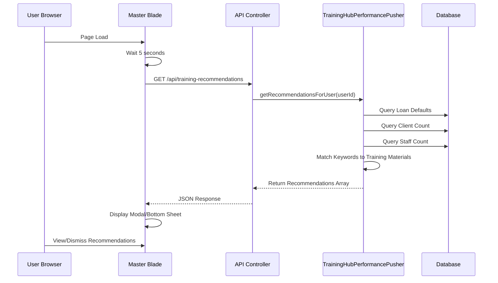

# Design Document: Training Hub Performance Refactor

## Overview

Refactor the `TrainingHubPerformancePusher` service to remove dependency on the Notifix service and implement real-time performance-based training recommendations. The refactored system will query actual performance data directly from the database and provide immediate recommendations through a frontend modal component.

## Main Algorithm/Workflow



## Core Interfaces/Types

```php
<?php

namespace App\Services;

use Illuminate\Support\Collection;

interface PerformanceRecommendation
{
    public string $type;
    public string $label;
    public string $icon;
    public string $color;
    public string $message;
    public string $link;
    public Collection $uploads;  // Collection<GeneralUpload>
    public Collection $topics;   // Collection<GeneralTopic>
}

class RecommendationResult
{
    public string $type;
    public string $label;
    public string $icon;
    public string $color;
    public string $message;
    public string $link;
    public Collection $uploads;
    public Collection $topics;
    
    public function __construct(
        string $type,
        string $label,
        string $icon,
        string $color,
        string $message,
        string $link,
        Collection $uploads,
        Collection $topics
    ) {
        $this->type = $type;
        $this->label = $label;
        $this->icon = $icon;
        $this->color = $color;
        $this->message = $message;
        $this->link = $link;
        $this->uploads = $uploads;
        $this->topics = $topics;
    }
}
```

## Key Functions with Formal Specifications

### Function 1: getRecommendationsForUser()

```php
public static function getRecommendationsForUser(int $userId): array
```

**Preconditions:**
- `$userId` is a valid positive integer
- `$userId` corresponds to an existing user in the database
- Database connection is available

**Postconditions:**
- Returns an array of recommendation objects
- Each recommendation contains: type, label, icon, color, message, link, uploads (Collection), topics (Collection)
- Array may be empty if no performance issues detected
- No side effects (read-only operation)

**Loop Invariants:** N/A (no loops in main function body)

### Function 2: checkLoanDefaults()

```php
private static function checkLoanDefaults(int $userId): ?RecommendationResult
```

**Preconditions:**
- `$userId` is a valid positive integer
- User exists in the database

**Postconditions:**
- Returns `RecommendationResult` if user has defaulted or overdue loans
- Returns `null` if no loan issues found
- Query checks: `status = 'defaulted'` OR `first_repayment_date < CURRENT_DATE`
- No mutations to database state

**Loop Invariants:** N/A

### Function 3: checkLowClientCount()

```php
private static function checkLowClientCount(int $userId): ?RecommendationResult
```

**Preconditions:**
- `$userId` is a valid positive integer
- User exists in the database

**Postconditions:**
- Returns `RecommendationResult` if user has < 15 active clients
- Returns `null` if client count >= 15
- Only counts non-deleted clients (`deleted_at IS NULL`)
- No mutations to database state

**Loop Invariants:** N/A

### Function 4: checkStaffTurnover()

```php
private static function checkStaffTurnover(int $userId): ?RecommendationResult
```

**Preconditions:**
- `$userId` is a valid positive integer
- User exists in the database
- User has an associated `office_id`

**Postconditions:**
- Returns `RecommendationResult` if user's office has < 15 staff members with `role_id = 4`
- Returns `null` if staff count >= 15 or user has no office
- No mutations to database state

**Loop Invariants:** N/A

### Function 5: findUploadsByKeywords()

```php
private static function findUploadsByKeywords(array $keywords): Collection
```

**Preconditions:**
- `$keywords` is a non-empty array of strings
- Each keyword is a non-empty string

**Postconditions:**
- Returns Collection of `GeneralUpload` models
- Collection contains up to 5 uploads matching any keyword
- Results ordered by `views_count DESC`
- Collection may be empty if no matches found

**Loop Invariants:**
- For each keyword iteration: Query builder accumulates OR WHERE clauses
- All previously added keywords remain in the query

### Function 6: findTopicsByKeywords()

```php
private static function findTopicsByKeywords(array $keywords): Collection
```

**Preconditions:**
- `$keywords` is a non-empty array of strings
- Each keyword is a non-empty string

**Postconditions:**
- Returns Collection of `GeneralTopic` models
- Collection contains up to 3 topics matching any keyword in name or description
- Collection may be empty if no matches found

**Loop Invariants:**
- For each keyword iteration: Query builder accumulates OR WHERE clauses
- All previously added keywords remain in the query

## Algorithmic Pseudocode

### Main Processing Algorithm

```pascal
ALGORITHM getRecommendationsForUser(userId)
INPUT: userId of type integer
OUTPUT: recommendations of type array

BEGIN
  ASSERT userId > 0
  ASSERT userExists(userId) = true
  
  // Initialize empty recommendations array
  recommendations ← []
  
  // Step 1: Check for loan defaults/overdue loans
  loanRec ← checkLoanDefaults(userId)
  IF loanRec ≠ null THEN
    recommendations.add(loanRec)
  END IF
  
  // Step 2: Check for low client count
  clientRec ← checkLowClientCount(userId)
  IF clientRec ≠ null THEN
    recommendations.add(clientRec)
  END IF
  
  // Step 3: Check for staff turnover at user's office
  staffRec ← checkStaffTurnover(userId)
  IF staffRec ≠ null THEN
    recommendations.add(staffRec)
  END IF
  
  ASSERT isArray(recommendations)
  ASSERT allElementsAreRecommendationResults(recommendations)
  
  RETURN recommendations
END
```

**Preconditions:**
- userId is a valid positive integer
- Database connection is available
- User exists in the database

**Postconditions:**
- Returns array of 0-3 recommendation objects
- Each recommendation is properly formatted with all required fields
- No database mutations occurred

**Loop Invariants:** N/A (sequential checks, no loops)

### Loan Defaults Check Algorithm

```pascal
ALGORITHM checkLoanDefaults(userId)
INPUT: userId of type integer
OUTPUT: recommendation of type RecommendationResult or null

BEGIN
  ASSERT userId > 0
  
  // Query for defaulted or overdue loans
  defaultedCount ← COUNT(
    SELECT * FROM loans 
    WHERE loan_officer_id = userId 
    AND (status = 'defaulted' OR first_repayment_date < CURRENT_DATE)
  )
  
  // Check threshold
  IF defaultedCount = 0 THEN
    RETURN null
  END IF
  
  // Find training materials
  keywords ← ['loan', 'vetting', 'due diligence', 'credit assessment', 'risk assessment']
  uploads ← findUploadsByKeywords(keywords)
  topics ← findTopicsByKeywords(keywords)
  
  // Build recommendation
  message ← "You have " + defaultedCount + " defaulted/overdue loan(s). We recommend reviewing vetting and due diligence training."
  link ← buildUploadLink(uploads)
  
  recommendation ← NEW RecommendationResult(
    type: 'perf_loan_default',
    label: 'Vetting & Due Diligence',
    icon: 'fa-exclamation-triangle',
    color: '#e74c3c',
    message: message,
    link: link,
    uploads: uploads,
    topics: topics
  )
  
  ASSERT recommendation.uploads.count() ≤ 5
  ASSERT recommendation.topics.count() ≤ 3
  
  RETURN recommendation
END
```

**Preconditions:**
- userId is a valid positive integer
- User exists in the database
- Loans table is accessible

**Postconditions:**
- Returns RecommendationResult if defaultedCount > 0
- Returns null if defaultedCount = 0
- No database mutations

**Loop Invariants:** N/A

### Low Client Count Check Algorithm

```pascal
ALGORITHM checkLowClientCount(userId)
INPUT: userId of type integer
OUTPUT: recommendation of type RecommendationResult or null

BEGIN
  ASSERT userId > 0
  
  // Query for active client count
  clientCount ← COUNT(
    SELECT * FROM clients 
    WHERE staff_id = userId 
    AND deleted_at IS NULL
  )
  
  // Check threshold
  IF clientCount ≥ 15 THEN
    RETURN null
  END IF
  
  // Find training materials
  keywords ← ['client', 'customer service', 'client retention', 'relationship management']
  uploads ← findUploadsByKeywords(keywords)
  topics ← findTopicsByKeywords(keywords)
  
  // Build recommendation
  message ← "You have " + clientCount + " active client(s), which is below the recommended threshold of 15. We recommend reviewing client management training."
  link ← buildUploadLink(uploads)
  
  recommendation ← NEW RecommendationResult(
    type: 'perf_low_clients',
    label: 'Client Management',
    icon: 'fa-user-plus',
    color: '#3498db',
    message: message,
    link: link,
    uploads: uploads,
    topics: topics
  )
  
  ASSERT recommendation.uploads.count() ≤ 5
  ASSERT recommendation.topics.count() ≤ 3
  
  RETURN recommendation
END
```

**Preconditions:**
- userId is a valid positive integer
- User exists in the database
- Clients table is accessible

**Postconditions:**
- Returns RecommendationResult if clientCount < 15
- Returns null if clientCount >= 15
- No database mutations

**Loop Invariants:** N/A

### Staff Turnover Check Algorithm

```pascal
ALGORITHM checkStaffTurnover(userId)
INPUT: userId of type integer
OUTPUT: recommendation of type RecommendationResult or null

BEGIN
  ASSERT userId > 0
  
  // Get user's office
  user ← SELECT * FROM users WHERE id = userId
  
  IF user.office_id IS NULL THEN
    RETURN null
  END IF
  
  // Query for staff count at office
  staffCount ← COUNT(
    SELECT * FROM users 
    WHERE office_id = user.office_id 
    AND role_id = 4
  )
  
  // Check threshold
  IF staffCount ≥ 15 THEN
    RETURN null
  END IF
  
  // Find training materials
  keywords ← ['leadership', 'management', 'team building', 'staff retention']
  uploads ← findUploadsByKeywords(keywords)
  topics ← findTopicsByKeywords(keywords)
  
  // Build recommendation
  message ← "Your office has " + staffCount + " staff member(s), which is below the recommended threshold of 15. We recommend reviewing leadership and management training."
  link ← buildUploadLink(uploads)
  
  recommendation ← NEW RecommendationResult(
    type: 'perf_staff_turnover',
    label: 'Leadership & Management',
    icon: 'fa-users',
    color: '#f39c12',
    message: message,
    link: link,
    uploads: uploads,
    topics: topics
  )
  
  ASSERT recommendation.uploads.count() ≤ 5
  ASSERT recommendation.topics.count() ≤ 3
  
  RETURN recommendation
END
```

**Preconditions:**
- userId is a valid positive integer
- User exists in the database
- Users table is accessible

**Postconditions:**
- Returns RecommendationResult if staffCount < 15 and user has office
- Returns null if staffCount >= 15 or user has no office
- No database mutations

**Loop Invariants:** N/A

### Keyword Search Algorithm

```pascal
ALGORITHM findUploadsByKeywords(keywords)
INPUT: keywords of type array of strings
OUTPUT: uploads of type Collection

BEGIN
  ASSERT keywords.length > 0
  ASSERT ALL keyword IN keywords: keyword ≠ ""
  
  // Build query with OR conditions
  query ← NEW QueryBuilder(GeneralUpload)
  
  FOR each keyword IN keywords DO
    ASSERT keyword IS string AND keyword ≠ ""
    query.orWhere('name', 'LIKE', '%' + keyword + '%')
  END FOR
  
  // Execute query with ordering and limit
  uploads ← query
    .orderBy('views_count', 'DESC')
    .limit(5)
    .get()
  
  ASSERT uploads IS Collection
  ASSERT uploads.count() ≤ 5
  
  RETURN uploads
END
```

**Preconditions:**
- keywords is a non-empty array
- All keywords are non-empty strings
- GeneralUpload table is accessible

**Postconditions:**
- Returns Collection of GeneralUpload models
- Collection size ≤ 5
- Results ordered by views_count descending
- No database mutations

**Loop Invariants:**
- All previously processed keywords are included in the query
- Query builder remains in valid state throughout iteration

## Example Usage

```php
<?php

// Example 1: Get recommendations for a user
$userId = 42;
$recommendations = TrainingHubPerformancePusher::getRecommendationsForUser($userId);

foreach ($recommendations as $rec) {
    echo "Type: " . $rec['type'] . "\n";
    echo "Label: " . $rec['label'] . "\n";
    echo "Message: " . $rec['message'] . "\n";
    echo "Uploads: " . $rec['uploads']->count() . "\n";
    echo "Topics: " . $rec['topics']->count() . "\n";
}

// Example 2: API Controller usage
class TrainingRecommendationController extends Controller
{
    public function getRecommendations(Request $request)
    {
        $userId = auth()->id();
        $recommendations = TrainingHubPerformancePusher::getRecommendationsForUser($userId);
        
        return response()->json([
            'success' => true,
            'recommendations' => $recommendations
        ]);
    }
}

// Example 3: Frontend AJAX call (JavaScript)
setTimeout(function() {
    fetch('/api/training-recommendations', {
        method: 'GET',
        headers: {
            'Content-Type': 'application/json',
            'X-CSRF-TOKEN': document.querySelector('meta[name="csrf-token"]').getAttribute('content')
        }
    })
    .then(response => response.json())
    .then(data => {
        if (data.success && data.recommendations.length > 0) {
            displayRecommendationModal(data.recommendations);
        }
    })
    .catch(error => console.error('Error fetching recommendations:', error));
}, 5000); // Wait 5 seconds after page load

// Example 4: Display modal function
function displayRecommendationModal(recommendations) {
    const modal = document.getElementById('performanceRecommendationModal');
    const content = document.getElementById('recommendationContent');
    
    let html = '';
    recommendations.forEach(rec => {
        html += `
            <div class="recommendation-item" style="border-left: 4px solid ${rec.color}; padding: 15px; margin-bottom: 15px;">
                <h4><i class="fa ${rec.icon}"></i> ${rec.label}</h4>
                <p>${rec.message}</p>
                <div class="training-materials">
                    <h5>Recommended Training:</h5>
                    <ul>
                        ${rec.uploads.map(upload => `<li><a href="${rec.link}">${upload.name}</a></li>`).join('')}
                    </ul>
                </div>
            </div>
        `;
    });
    
    content.innerHTML = html;
    modal.classList.add('active');
}
```

## Correctness Properties

*A property is a characteristic or behavior that should hold true across all valid executions of a system—essentially, a formal statement about what the system should do. Properties serve as the bridge between human-readable specifications and machine-verifiable correctness guarantees.*

### Property 1: Recommendation Count Bounds

*For any* user, the system SHALL return between 0 and 3 recommendations inclusive.

**Validates: Requirements 9.1, 10.1**

### Property 2: Valid Recommendation Structure

*For any* recommendation returned by the system, the recommendation SHALL contain a type field with value in {'perf_loan_default', 'perf_low_clients', 'perf_staff_turnover'}, a non-empty label field, a non-empty icon field, a color field matching hexadecimal format, a non-empty message field, a link field containing a valid URL, an uploads field containing a Collection, and a topics field containing a Collection.

**Validates: Requirements 6.1, 6.2, 6.3, 6.4, 6.5, 6.6, 6.7, 6.8**

### Property 3: Upload Limit Per Recommendation

*For any* recommendation returned by the system, the uploads collection SHALL contain at most 5 items.

**Validates: Requirements 5.4, 9.2**

### Property 4: Topic Limit Per Recommendation

*For any* recommendation returned by the system, the topics collection SHALL contain at most 3 items.

**Validates: Requirements 5.7, 9.3**

### Property 5: Idempotency

*For any* user and any two points in time where the database state is identical, calling the system with the same user ID SHALL return identical results.

**Validates: Requirement 10.2**

### Property 6: Loan Default Threshold (Bidirectional)

*For any* user, a recommendation of type 'perf_loan_default' SHALL exist in the results if and only if the user has one or more defaulted or overdue loans.

**Validates: Requirements 2.1, 2.2**

### Property 7: Loan Default Message Contains Count

*For any* user with one or more defaulted or overdue loans, the loan default recommendation message SHALL contain the count of defaulted loans.

**Validates: Requirement 2.3**

### Property 8: Client Count Threshold (Bidirectional)

*For any* user, a recommendation of type 'perf_low_clients' SHALL exist in the results if and only if the user has fewer than 15 active clients.

**Validates: Requirements 3.1, 3.2**

### Property 9: Client Count Message Contains Count

*For any* user with fewer than 15 active clients, the low client count recommendation message SHALL contain the actual client count.

**Validates: Requirement 3.3**

### Property 10: Staff Count Threshold (Bidirectional)

*For any* user with an office_id, a recommendation of type 'perf_staff_turnover' SHALL exist in the results if and only if the user's office has fewer than 15 staff members with role_id = 4.

**Validates: Requirements 4.1, 4.3**

### Property 11: Staff Count Message Contains Count

*For any* user whose office has fewer than 15 staff members with role_id = 4, the staff turnover recommendation message SHALL contain the actual staff count.

**Validates: Requirement 4.4**

### Property 12: Upload Search OR Logic

*For any* set of keywords used to search for training uploads, the results SHALL include uploads that match at least one keyword (OR logic, not AND logic).

**Validates: Requirement 5.2**

### Property 13: Upload Search Ordering

*For any* upload search results, the results SHALL be ordered by views_count in descending order.

**Validates: Requirement 5.3**

### Property 14: Topic Search OR Logic

*For any* set of keywords used to search for training topics, the results SHALL include topics that match at least one keyword in either the name or description field.

**Validates: Requirement 5.6**

### Property 15: No Duplicate Recommendation Types

*For any* user, all recommendations in the results SHALL have unique type values (no two recommendations with the same type).

**Validates: Requirement 9.4**

### Property 16: Read-Only Operation

*For any* user and any database table, the database state before calling the system SHALL be identical to the database state after calling the system.

**Validates: Requirements 1.4, 10.3**
