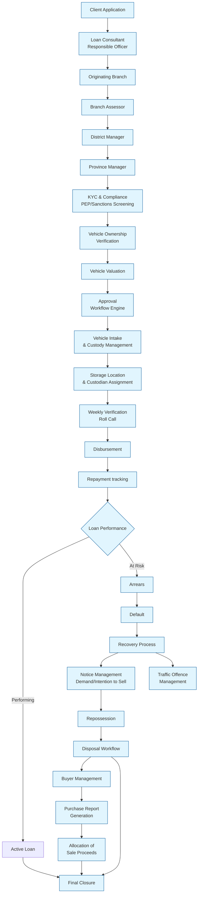
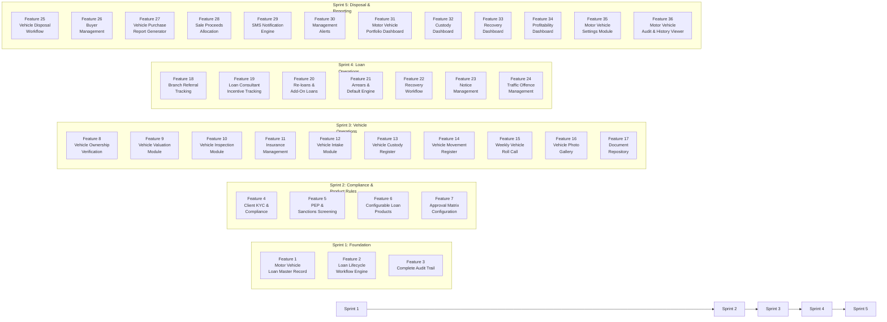
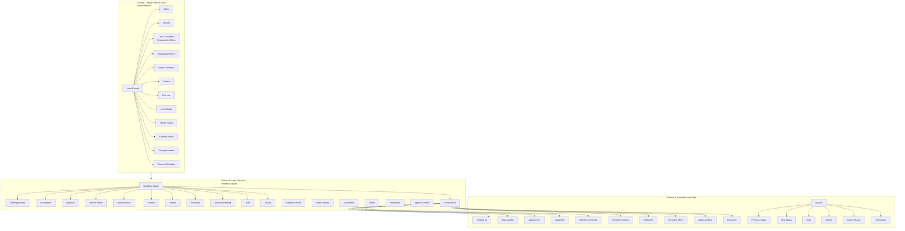
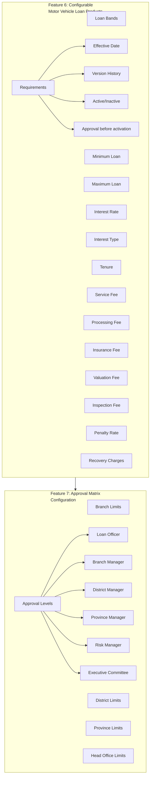
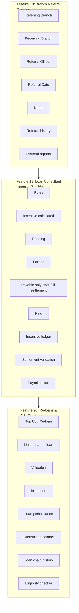
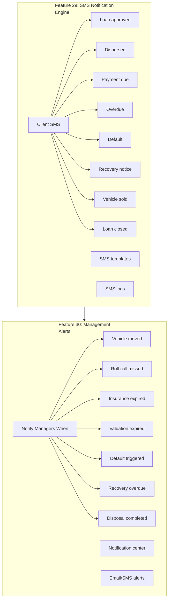
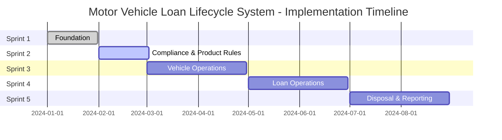

# Motor Vehicle Loan Lifecycle System - Implementation Flow Chart

## Complete Loan Lifecycle Flow



## Implementation Phases Flow



## Phase 1: Foundation (Features 1-3)



## Phase 2: Customer Compliance & KYC

```mermaid
flowchart TD
    subgraph KYC[Feature 4: Client KYC &<br/>Compliance]
        KYC[KYC Fields]
        KYC --> NRC[NRC/Passport]
        KYC --> TPIN[TPIN]
        KYC --> Addr[Address]
        KYC --> Emp[Employer]
        KYC --> Biz[Business Details]
        KYC --> Inc[Income]
        KYC --> Phone[Phone numbers]
        KYC --> Email[Email]
        KYC --> NOK[Next of Kin]
        KYC --> Guar[Guarantor info]
        
        Upl[Document Uploads]
        Upl --> NRC_F[NRC Front]
        Upl --> NRC_B[NRC Back]
        Upl --> Selfie[Selfie]
        Upl --> UB[Utility Bill]
        Upl --> EL[Employment Letter]
        Upl --> Pay[Payslip]
    end
    
    subgraph PEP[Feature 5: PEP &<br/>Sanctions Screening]
        PEPResult[PEP Result]
        Sanct[Sanctions Result]
        ScrDate[Screening Date]
        ScrOff[Screening Officer]
        MatchL[Match Level]
        Comments[Comments]
        Evidence[Supporting Evidence]
        
        ScrFlow[PEP Workflow]
        ScrFlow --> Pend[Pending]
        ScrFlow --> Clr[Cleared]
        ScrFlow --> Flag[Flagged]
        ScrFlow --> Rvw[Requires Review]
    end
    
    KYC --> PEP
```

## Phase 3: Product Configuration



## Phase 4: Vehicle Operations

```mermaid
flowchart TD
    subgraph Own[Feature 8: Vehicle Ownership<br/>Verification]
        OwnType[Ownership Types]
        OwnType --> Ind[Individual]
        OwnType --> LoS[Letter of Sale]
        OwnType --> Corp[Company/Corporate]
        
        IndReq[Individual Requirements]
        IndReq --> RegOwner[Registered Owner]
        IndReq --> S[ Seller]
        IndReq --> Docs[Ownership Documents]
        
        LSRq[Letter of Sale Requirements]
        LSRq --> LUL[Letter upload]
        LSRq --> SvV[Seller verification]
        LSRq --> Wit[Witnesses]
        
        CorpReq[Corporate Requirements]
        CorpReq --> CR[Company Registration]
        CorpReq --> Dir[Directors]
        CorpReq --> Res[Resolution]
        CorpReq --> AR[Authorized Representative]
    end
    
    subgraph Val[Feature 9: Vehicle Valuation<br/>Module]
        ValComp[Valuation Company]
        Valuat[Valuator]
        MktVal[Market Value]
        FsVal[Forced Sale Value]
        ValCost[Valuation Cost]
        ExpDate[Expiry Date]
        
        ValUpl[Uploads]
        ValUpl --> ValRprt[Valuation Report]
        ValUpl --> Photos[Photos]
        ValUpl --> Docs2[Supporting Docs]
        
        ValHist[Valuation history]
        ExpAlert[Expiry alerts]
    end
    
    subgraph Insp[Feature 10: Vehicle Inspection<br/>Module]
        InstDate[Inspection Date]
        Inspector[Inspector]
        Mileage[Mileage]
        Mech[Mechanical Condition]
        Int[Interior]
        Ext[Exterior]
        Tires[Tyres]
        Batt[Battery]
        Acc[Accessories]
        
        InspUpl[Upload]
        InspUpl --> InspRprt[Inspection Report]
        InspUpl --> InspPhotos[Inspection Photos]
        
        Check[Inspection checklist]
        CondScore[Condition score]
    end
    
    subgraph Ins[Feature 11: Insurance<br/>Management]
        InsComp[Insurance Company]
        PolNum[Policy Number]
        StDate[Start Date]
        EndDate[End Date]
        Prem[Premium]
        Cover[Cover Type]
        
        InsAlert[Expiring/Expired insurance]
    end
    
    subgraph Intake[Feature 12: Vehicle Intake<br/>Module]
        IntDate[Intake Date]
        RcvOf[Receiving Officer]
        Cond[Condition]
        Keys[Keys Received]
        DocsR[Documents Received]
        AccR[Accessories Received]
        Fuel[Fuel Level]
        
        IntUpl[Upload]
        IntUpl --> IntPhotos[Intake Photos]
        IntUpl --> SIF[Signed Intake Form]
        
        Checklist[Intake checklist]
        IntRpt[Intake report PDF]
    end
    
    subgraph Cust[Feature 13: Vehicle Custody<br/>Register]
        SLoc[Storage Location]
        GPS[GPS/Location Description]
        HO[House/Garage Owner]
        CN[Custodian Name]
        NRC2[NRC]
        PH[Phone]
        AltContact[Alternative Contact]
        SDS[Storage Start Date]
        Notes[Notes]
        
        CustReg[Custody Register]
        CCV[Current Custody Card]
        CustHist[Custody history]
    end
    
    subgraph Mov[Feature 14: Vehicle Movement<br/>Register]
        PrevLoc[Previous Location]
        NewLoc[New Location]
        MovDate[Movement Date]
        AuthBy[Authorized By]
        MovBy[Moved By]
        Reason[Reason]
        Cond2[Condition]
        Photos2[Photos]
        
        MovHist[Movement history]
        TransferApp[Transfer approval workflow]
    end
    
    subgraph RollCall[Feature 15: Weekly Vehicle<br/>Roll Call]
        VerifDate[Verification Date]
        Officer[Officer]
        LocConf[Location Confirmed]
        VehPres[Vehicle Present]
        Cond3[Condition]
        Mileage2[Current Mileage]
        Photos3[Photos]
        
        Status[Verified/ Missing/ Damaged/ Relocated]
    end
    
    subgraph Gallery[Feature 16: Vehicle Photo<br/>Gallery]
        Cat[Categories: Intake, Verification, Inspection, Valuation, Recovery, Disposal]
        DateP[Date]
        Officer2[Officer]
        Caption[Caption]
        
        Gallery[Gallery]
        Timeline[Timeline]
    end
    
    subgraph DocRep[Feature 17: Document<br/>Repository]
        Docs[Store: NRC, Valuation Reports, Insurance, Letters of Sale, Registration, Road Tax, Fitness, Recovery Notices, Sale Documents]
        
        DocMgr[Document manager]
        ExpTrack[Expiry tracker]
        DV[Download/view]
    end
    
    Own --> Val --> Insp --> Ins --> Intake --> Cust --> Mov --> RollCall > Gallery
    Gallery --> DocRep
```

## Phase 5: Loan Operations



## Phase 6: Default & Recovery

```mermaid
flowchart TD
    subgraph Arrears[Feature 21: Arrears &<br/>Default Engine]
        States[Automatic States]
        States --> Due[Due]
        States --> Over[Overdue]
        States --> Arrears[Arrears]
        States --> DefDefault[Default]
        
        Rules[Configurable Rules]
        Grace[Grace Period]
        D2Def[Days to Default]
        Penalty[Penalty]
        
        Calc[Default calculator]
        Dash[Arrears dashboard]
    end
    
    subgraph Rec[Feature 22: Recovery<br/>Workflow]
        Stages[Recovery Stages]
        Stages --> Rem[Reminder]
        Stages --> DN[Demand Notice]
        Stages --> NOI[Notice of Intention to Sell]
        Stages --> Rep[Repossession]
        Stages --> RecProc[Recovery in Progress]
        Stages --> RecComp[Recovery Complete]
        
        RecCase[Recovery case module]
        OfficerAss[Officer assignment]
        RecTime[Timeline]
    end
    
    subgraph Notice[Feature 23: Notice<br/>Management]
        AutoGen[Auto Generate]
        AutoGen --> RemL[Reminder Letters]
        AutoGen --> DemL[Demand Letters]
        AutoGen --> INT[Intent to Sell]
        AutoGen --> Final[Final Notices]
        
        PDF[PDF generation]
        SMStrig[SMS trigger]
        ET[Email trigger]
    end
    
    subgraph Traffic[Feature 24: Traffic Offence<br/>Management]
        Offence[Offence]
        Date2[Date]
        Amount[Amount]
        PaidBy[Paid By]
        Status2[Status]
        Receipt[Receipt]
        
        Ledger[Traffic offence ledger]
        OutStanding[Outstanding offences report]
    end
    
    Arrears --> Rec --> Notice
    Rec --> Traffic
```

## MVL Entry via Client Loan Creation (Integration)

```mermaid
flowchart LR
    subgraph CreateLoan[Create Client Loan (create_client_loan.blade.php)]
        CL[Client Loan Form]
        CL --> CheckProd{Is Motor Vehicle<br/>Loan Product?}
        CheckProd -->|Yes| Collateral[@if: Hide Collateral Field]
        CheckProd -->|Yes| MVLField[Add mvl_next hidden field = 1]
        CheckProd -->|Yes| SubmitBtn[Submit Button: "Save and proceed to KYC/PEP verification"]
        CheckProd -->|No| DefaultBtn[Submit Button: "Submit"]
    end

    subgraph LoanController[LoanController::storeClientLoan]
        Create[Create Loan Record]
        CheckMVL{mvl_next == 1?}
        CheckMVL -->|Yes| CreateMVL[Create MotorVehicleLoan Record]
        CreateMVL --> SetFields[loan_id, client_id, status=draft]
        SetFields --> Redirect[Redirect to compliance-screening]
        Redirect --> UseMVL[Use MotorVehicleLoan->id]
        CheckMVL -->|No| CheckCollateral{has_collateral?}
        CheckCollateral -->|Yes| RedirectCollateral[Redirect to collateral/create]
        CheckCollateral -->|No| RedirectLoan[Redirect to loan/{id}/show]
    end

    subgraph DBMigr[Migrations]
        VehicleID[make vehicle_id nullable]
        VehicleID --> MVLTable[motor_vehicle_loans table]
    end

    CreateLoan --> LoanController
    LoanController --> DBMigr

    style CreateLoan fill:#e1f5fe,stroke:#01579b
    style LoanController fill:#e8f5e9,stroke:#1b5e20
    style DBMigr fill:#fff3e0,stroke:#e65100
```

### Compliance Screening Route

```mermaid
flowchart LR
    A[LoanController] --> B[Rouverse to]
    B --> C[motor-vehicle-loans/{id}<br/>/compliance-screening]
    C --> D[MotorVehicleLoanLifecycleController<br/>@complianceScreening]
    D --> E[Load MotorVehicleLoan by ID<br/>+ load Client relationship]
    E --> F[View: motor_vehicle.loan_lifecycle.<br/>compliance_screening]

    style A fill:#e1f5fe,stroke:#01579b
    style D fill:#e8f5e9,stroke:#1b5e20
    style F fill:#fff3e0,stroke:#e65100
```

### Files Modified

| File | Change |
|------|--------|
| `resources/views/loan/create_client_loan.blade.php` | Added `@if($loan_product->id != 0)` around collateral field; added `mvl_next` hidden field; conditional submit button text |
| `app/Http/Controllers/LoanController.php` (line 1638-1646) | Creates `MotorVehicleLoan` record with `loan_id`, `client_id`, `status='draft'`; redirects using `$mvl->id` |
| `database/migrations/2026_09_02_115700_make_vehicle_id_nullable_in_motor_vehicle_loans_table.php` | Makes `vehicle_id` nullable in `motor_vehicle_loans` table |

## Phase 5: Disposal & Sale Management

```mermaid
flowchart TD
    subgraph Dispose[Feature 25: Vehicle Disposal<br/>Workflow]
        Stages[Stages]
        Stages --> DispApp[Disposal Approved]
        Stages --> ValDisp[Valuation]
        Stages --> Sale[Sale]
        Stages --> Pay[Payment]
        Stages --> Rel[Release]
        Stages --> Closed2[Closed]
        
        AppRec[Approval records]
    end
    
    subgraph Buyer[Feature 26: Buyer<br/>Management]
        BuyerDet[Full Name]
        BuyerNRC[NRC]
        BuyerAddr[Address]
        BuyerPhone[Phone]
        BuyerEmail[Email]
        BuyerComp[Company Details]
        
        BuyerProf[Buyer profile]
        BuyerHist[Buyer history]
    end
    
    subgraph PurchRep[Feature 27: Vehicle Purchase<br/>Report Generator]
        AutoPDF[Auto Generate PDF]
        
        Contents[Include: Buyer details, Vehicle details, Purchase price, As-Is declaration, Signatures, Witnesses, Sale date]
        
        PrintRep[Printable report]
        DigCopy[Digital copy storage]
    end
    
    subgraph Alloc[Feature 28: Sale Proceeds<br/>Allocation]
        SaleAmt[Sale Amount]
        Princ[Outstanding Principal]
        Int[Interest]
        Pen[Penalties]
        RecCost[Recovery Costs]
        StorCost[Storage Costs]
        LegCost[Legal Costs]
        Surpl[Surplus]
        
        AllocJ[Allocation journal]
        DispRpt[Disposal financial report]
    end
    
    Dispose --> Buyer --> PurchRep --> Alloc
```



## Phase 8: Notifications & Automation



## Phase 9: Reporting & Dashboards

```mermaid
flowchart TD
    subgraph Portfol[Feature 31: Motor Vehicle<br/>Portfolio Dashboard]
        KPIs[KPIs]
        KPIs --> PortVal[Portfolio Value]
        KPIs --> OutBal2[Outstanding Balance]
        KPIs --> ActLoans[Active Loans]
        KPIs --> AArrears[Arrears]
        KPIs --> Defaults[Defaults]
        KPIs --> Recov[Recoveries]
        KPIs --> Dispos[Disposals]
        KPIs --> Profit[Profitability]
        
        Filters[Filters]
        Filters --> Prov2[Province]
        Filters --> Dist2[District]
        Filters --> Branch2[Branch]
        Filters --> Officer3[Officer]
        Filters --> DateRange[Date Range]
    end
    
    subgraph CustDash[Feature 32: Custody<br/>Dashboard]
        InCust[Vehicles in custody]
        ByProv[By Province]
        ByDist[By District]
        ByBranch[By Branch]
        Missing[Missing vehicles]
        VerComp[Verification compliance]
        Storage[Storage occupancy]
    end
    
    subgraph RecDash[Feature 33: Recovery<br/>Dashboard]
        RecPipe[Recovery pipeline]
        Notices[Notices issued]
        Reposs[Repossessions]
        AWAIT[ehicles awaiting sale]
        SaleProv[Sale proceeds]
        RecSucc[Recovery success rate]
    end
    
    subgraph ProfitDash[Feature 34: Profitability<br/>Dashboard]
        IntEarn[Interest earned]
        FeesEarn[Fees earned]
        RecInc[Recovery income]
        DispInc[Disposal income]
        RecExp[Recovery expenses]
        StorExp[Storage expenses]
        NetProfit[Net profitability]
    end
    
    Portfol --> CustDash --> RecDash --> ProfitDash
```



## Phase 10: Administration & Configuration

```mermaid
flowchart TD
    subgraph Settings[Feature 35: Motor Vehicle<br/>Settings Module]
        ConfigItems[Configurable Items]
        ConfigItems --> IntRate2[Interest Rates]
        ConfigItems --> LoanBands2[Loan Bands]
        ConfigItems --> Tenure2[Tenure]
        ConfigItems --> Fees[Fees]
        ConfigItems --> Penalties[Penalties]
        ConfigItems --> RecTimelines[Recovery timelines]
        ConfigItems --> NoticePer[Notice periods]
        ConfigItems --> ApprLimits[Approval limits]
        ConfigItems --> IncentPct[Incentive percentages]
        ConfigItems --> StorageVer[Storage verification frequency]
        
        PerfDate[Effective date management]
        VerHist2[Version history]
    end
    
    subgraph AuditView[Feature 36: Motor Vehicle<br/>Audit & History Viewer]
        Timeline[Single Timeline Showing]
        Timeline --> Client2[Client]
        Timeline --> Staff[Staff Member]
        Timeline --> Branch3[Branch]
        Timeline --> Assessor[Branch-Assessor]
        Timeline --> District2[District]
        Timeline --> Province3[Province]
        Timeline --> KYC2[KYC]
        Timeline --> Ownership[Ownership Verification]
        Timeline --> Val2[Valuation]
        Timeline --> Appr2[Approval]
        Timeline --> Intake2[Intake]
        Timeline --> Storage[Storage Location]
        Timeline --> Cust2[Custodian]
        Timeline --> WeekVer[Weekly Verification]
        Timeline --> Disburse2[Disbursement]
        Timeline --> Repay[Repayment]
        Timeline --> Default2[Default]
        Timeline --> Rec2[Recovery]
        Timeline --> Dispo[Disposal]
        Timeline --> Buyer2[Buyer]
        Timeline --> Closure[Closure]
        
        ExpandHist[Expandable event history]
        DocsPhotos[Linked documents/photos]
        OfficerAT[Officer audit trail]
    end
    
    Settings --> AuditView
```



## Complete Implementation Sequence

