# Motor Vehicle Loan Lifecycle System — Complete Flow Chart

## Overview

This document provides a comprehensive visual representation of the entire Motor Vehicle Loan Lifecycle System, organized into 12 phases and 36 feature groups.

---

## System Architecture Overview

```mermaid
graph TB
    subgraph "PHASE 1: FOUNDATION"
        FG1[Feature Group 1<br/>Master Record]
        FG2[Feature Group 2<br/>Workflow Engine]
        FG3[Feature Group 3<br/>Audit Trail]
    end

    subgraph "PHASE 2: COMPLIANCE & KYC"
        FG4[Feature Group 4<br/>Client KYC]
        FG5[Feature Group 5<br/>PEP & Sanctions]
    end

    subgraph "PHASE 3: PRODUCT CONFIG"
        FG6[Feature Group 6<br/>Loan Products]
        FG7[Feature Group 7<br/>Approval Matrix]
    end

    subgraph "PHASE 4: VEHICLE OWNERSHIP"
        FG8[Feature Group 8<br/>Ownership Verification]
        FG9[Feature Group 9<br/>Valuation]
        FG10[Feature Group 10<br/>Inspection]
        FG11[Feature Group 11<br/>Insurance]
    end

    subgraph "PHASE 5: INTAKE & CUSTODY"
        FG12[Feature Group 12<br/>Vehicle Intake]
        FG13[Feature Group 13<br/>Custody Register]
        FG14[Feature Group 14<br/>Movement Register]
        FG15[Feature Group 15<br/>Weekly Roll Call]
    end

    subgraph "PHASE 6: MEDIA & DOCUMENTS"
        FG16[Feature Group 16<br/>Photo Gallery]
        FG17[Feature Group 17<br/>Document Repository]
    end

    subgraph "PHASE 7: REPAYMENTS & INCENTIVES"
        FG18[Feature Group 18<br/>Branch Referrals]
        FG19[Feature Group 19<br/>Consultant Incentives]
        FG20[Feature Group 20<br/>Re-loans & Top-Ups]
    end

    subgraph "PHASE 8: DEFAULT & RECOVERY"
        FG21[Feature Group 21<br/>Arrears Engine]
        FG22[Feature Group 22<br/>Recovery Workflow]
        FG23[Feature Group 23<br/>Notice Management]
        FG24[Feature Group 24<br/>Traffic Offences]
    end

    subgraph "PHASE 9: DISPOSAL & SALE"
        FG25[Feature Group 25<br/>Disposal Workflow]
        FG26[Feature Group 26<br/>Buyer Management]
        FG27[Feature Group 27<br/>Purchase Reports]
        FG28[Feature Group 28<br/>Proceeds Allocation]
    end

    subgraph "PHASE 10: NOTIFICATIONS"
        FG29[Feature Group 29<br/>SMS Engine]
        FG30[Feature Group 30<br/>Management Alerts]
    end

    subgraph "PHASE 11: REPORTING"
        FG31[Feature Group 31<br/>Portfolio Dashboard]
        FG32[Feature Group 32<br/>Custody Dashboard]
        FG33[Feature Group 33<br/>Recovery Dashboard]
        FG34[Feature Group 34<br/>Profitability Dashboard]
    end

    subgraph "PHASE 12: ADMINISTRATION"
        FG35[Feature Group 35<br/>Settings Module]
        FG36[Feature Group 36<br/>Audit & History Viewer]
    end

    FG1 --> FG2 --> FG3
    FG3 --> FG4 --> FG5
    FG5 --> FG6 --> FG7
    FG7 --> FG8 --> FG9 --> FG10 --> FG11
    FG11 --> FG12 --> FG13 --> FG14 --> FG15
    FG15 --> FG16 --> FG17
    FG17 --> FG18 --> FG19 --> FG20
    FG20 --> FG21 --> FG22 --> FG23 --> FG24
    FG24 --> FG25 --> FG26 --> FG27 --> FG28
    FG28 --> FG29 --> FG30
    FG30 --> FG31 --> FG32 --> FG33 --> FG34
    FG34 --> FG35 --> FG36
```

---

## Complete Loan Lifecycle Flow

```mermaid
flowchart LR
    subgraph "ORIGINATION"
        A[Client Application] --> B[KYC Verification]
        B --> C[PEP/Sanctions Screening]
        C --> D[Product Selection]
    end

    subgraph "ASSESSMENT"
        D --> E[Vehicle Valuation]
        E --> F[Vehicle Inspection]
        F --> G[Ownership Verification]
        G --> H[Compliance Check]
    end

    subgraph "APPROVAL"
        H --> I[Approval Matrix]
        I --> J{Approved?}
        J -->|Yes| K[Loan Approval]
        J -->|No| L[Rejected/Revision]
    end

    subgraph "DISBURSEMENT"
        K --> M[Vehicle Intake]
        M --> N[Insurance Setup]
        N --> O[Custody Registration]
        O --> P[Disbursement]
    end

    subgraph "ACTIVE MANAGEMENT"
        P --> Q[Repayment Monitoring]
        Q --> R[Weekly Roll Call]
        R --> S[Movement Tracking]
        S --> T{Current?}
        T -->|Yes| Q
        T -->|No| U[Arrears Detection]
    end

    subgraph "DEFAULT & RECOVERY"
        U --> V[Reminder Notice]
        V --> W[Demand Notice]
        W --> X[Intention to Sell]
        X --> Y[Repossession]
        Y --> Z[Recovery Complete]
    end

    subgraph "DISPOSAL"
        Z --> AA[Disposal Approval]
        AA --> AB[Buyer Identification]
        AB --> AC[Sale Execution]
        AC --> AD[Proceeds Allocation]
        AD --> AE[Final Closure]
    end

    L --> A
```

---

## Phase 1: Foundation (Core Data & Workflow)

### Feature Group 1: Motor Vehicle Loan Master Record

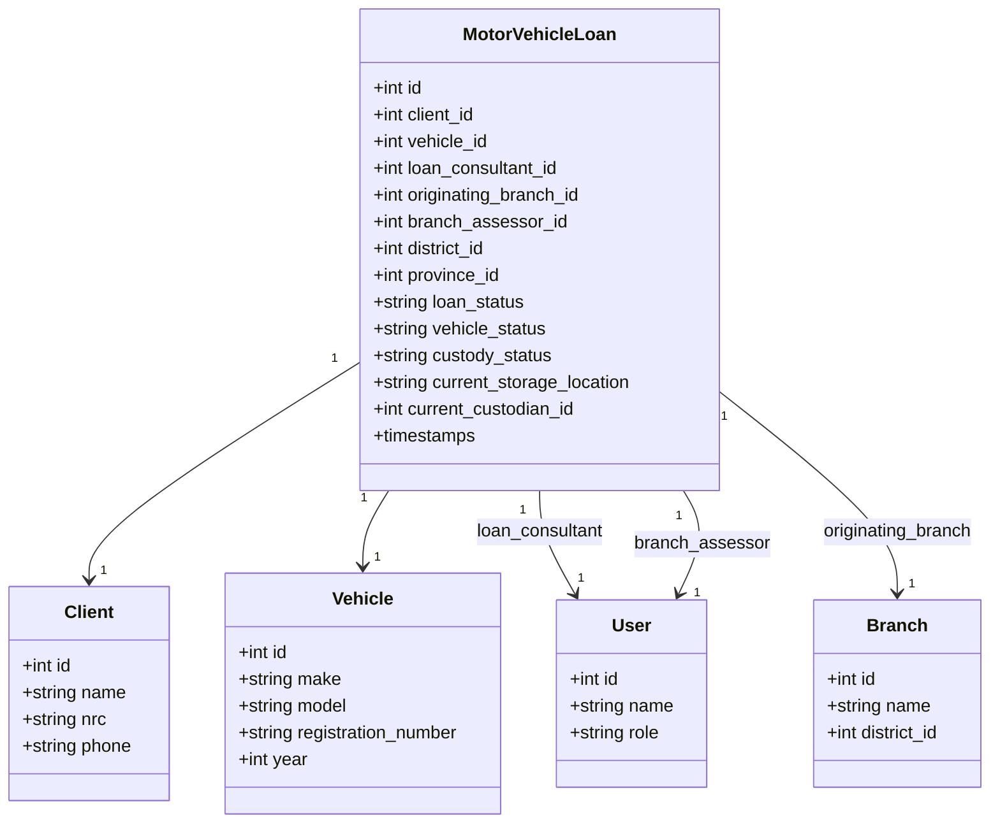

**Key Deliverables:**
- Database migration for `motor_vehicle_loans` table
- Model with all relationships
- CRUD forms for loan management
- Details page showing ownership hierarchy

---

### Feature Group 2: Loan Lifecycle Workflow Engine

```mermaid
stateDiagram-v2
    [*] --> Draft
    Draft --> Assessment : Submit
    Assessment --> Approval : Assessor Review
    Assessment --> Draft : Revision Required
    Approval --> VehicleIntake : Approved
    Approval --> Draft : Rejected
    VehicleIntake --> Disbursement : Vehicle Received
    Disbursement --> ActiveLoan : Funds Released
    ActiveLoan --> Arrears : Missed Payment
    ActiveLoan --> Closed : Fully Repaid
    Arrears --> Default : Threshold Exceeded
    Arrears --> ActiveLoan : Payment Received
    Default --> Recovery : Recovery Initiated
    Default --> ActiveLoan : Payment Received
    Recovery --> DisposalPending : Vehicle Repossessed
    Recovery --> ActiveLoan : Settled
    DisposalPending --> Sold : Vehicle Sold
    Sold --> Closed : Proceeds Allocated
    Closed --> [*]
```

**Workflow Stages:**
| Stage | Description | Transitions |
|-------|-------------|-------------|
| Draft/Application | Initial loan creation | → Assessment |
| Assessment | Loan consultant review | → Approval, → Draft |
| Approval | Management approval | → Vehicle Intake, → Draft |
| Vehicle Intake | Vehicle reception | → Disbursement |
| Disbursement | Funds released | → Active Loan |
| Active Loan | Repayment phase | → Arrears, → Closed |
| Arrears | Missed payments | → Default, → Active Loan |
| Default | Threshold exceeded | → Recovery, → Active Loan |
| Recovery | Recovery process | → Disposal Pending, → Active Loan |
| Disposal Pending | Awaiting sale | → Sold |
| Sold | Vehicle disposed | → Closed |
| Closed | Loan complete | → End |

**Key Deliverables:**
- Workflow service with transition rules
- Status timeline component
- Workflow permissions system

---

### Feature Group 3: Complete Audit Trail

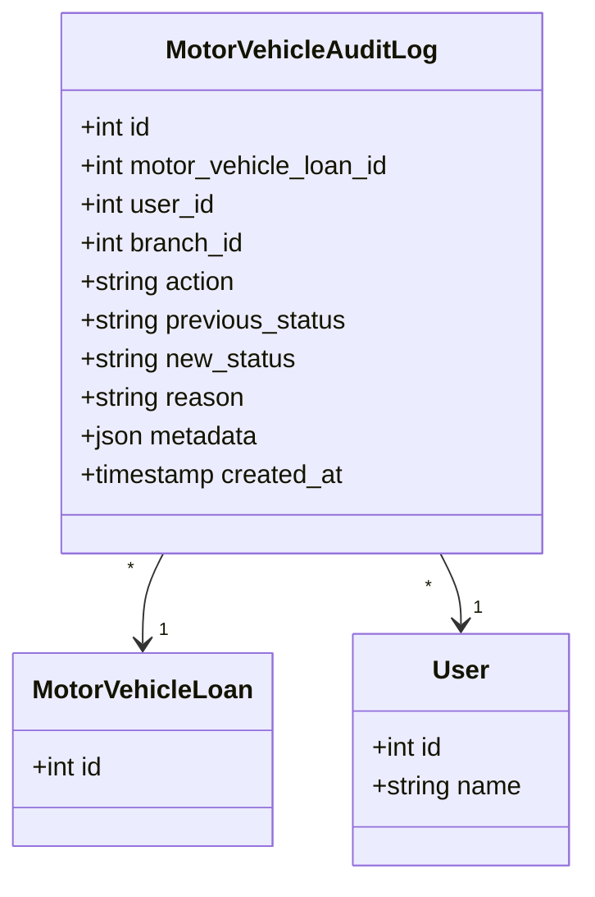

**Tracked Actions:**
- Created by
- Assessed by
- Approved by
- Valuated by
- Vehicle received by
- Vehicle moved by
- Verified by
- Recovery officer
- Disposal officer
- Closed by

**Key Deliverables:**
- Audit log table
- Audit timeline UI
- Activity history tab

---

## Phase 2: Customer Compliance & KYC

### Feature Group 4: Client KYC & Compliance

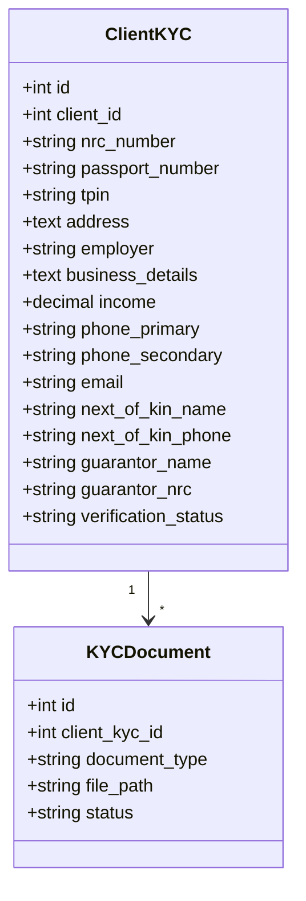

**Document Types:**
- NRC Front
- NRC Back
- Selfie
- Utility Bill
- Employment Letter
- Payslip

**Key Deliverables:**
- KYC section in client profile
- Document upload manager
- Verification status tracking

---

### Feature Group 5: PEP & Sanctions Screening

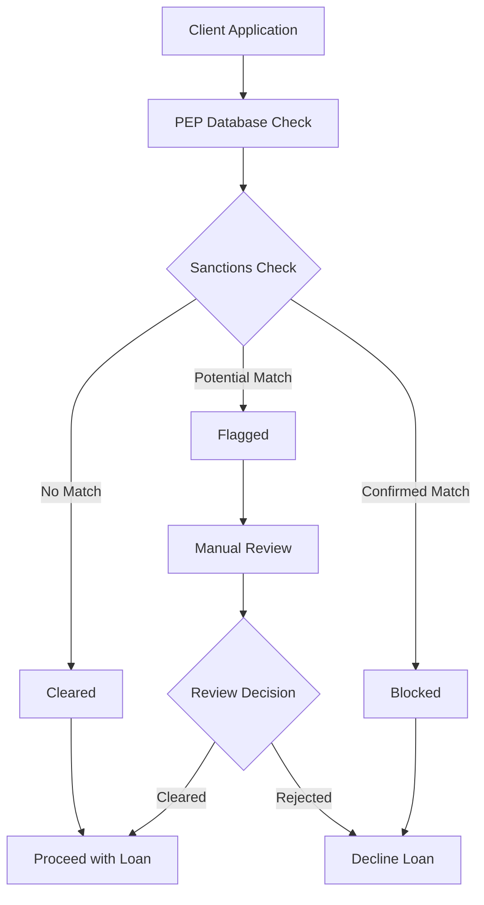

**Screening Fields:**
| Field | Type | Description |
|-------|------|-------------|
| PEP Result | enum | No Match, Potential, Confirmed |
| Sanctions Result | enum | No Match, Potential, Confirmed |
| Screening Date | date | When screening performed |
| Screening Officer | fk | User who performed screening |
| Match Level | string | Level of match found |
| Comments | text | Officer notes |
| Supporting Evidence | file | Upload documentation |

**Workflow States:**
- Pending
- Cleared
- Flagged
- Requires Review

**Key Deliverables:**
- Compliance card on loan record
- Approval blocker if not cleared
- Compliance report generation

---

## Phase 3: Product Configuration

### Feature Group 6: Configurable Motor Vehicle Loan Products

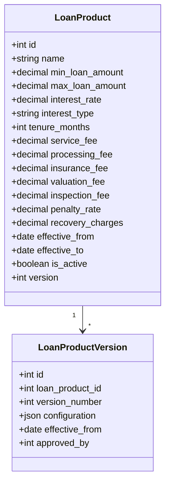

**Configurable Parameters:**
| Parameter | Type | Description |
|-----------|------|-------------|
| Loan Bands | decimal | Min/Max loan amounts |
| Interest Rate | decimal | Annual rate |
| Interest Type | enum | Flat, Reducing, Fixed |
| Tenure | integer | Months |
| Service Fee | decimal | Percentage/Fixed |
| Processing Fee | decimal | Application fee |
| Insurance Fee | decimal | Insurance cost |
| Valuation Fee | decimal | Vehicle valuation cost |
| Inspection Fee | decimal | Inspection cost |
| Penalty Rate | decimal | Late payment penalty |
| Recovery Charges | decimal | Recovery cost |

**Key Deliverables:**
- Product Configuration module
- Parameter Version table
- Admin UI for configuration

---

### Feature Group 7: Approval Matrix Configuration

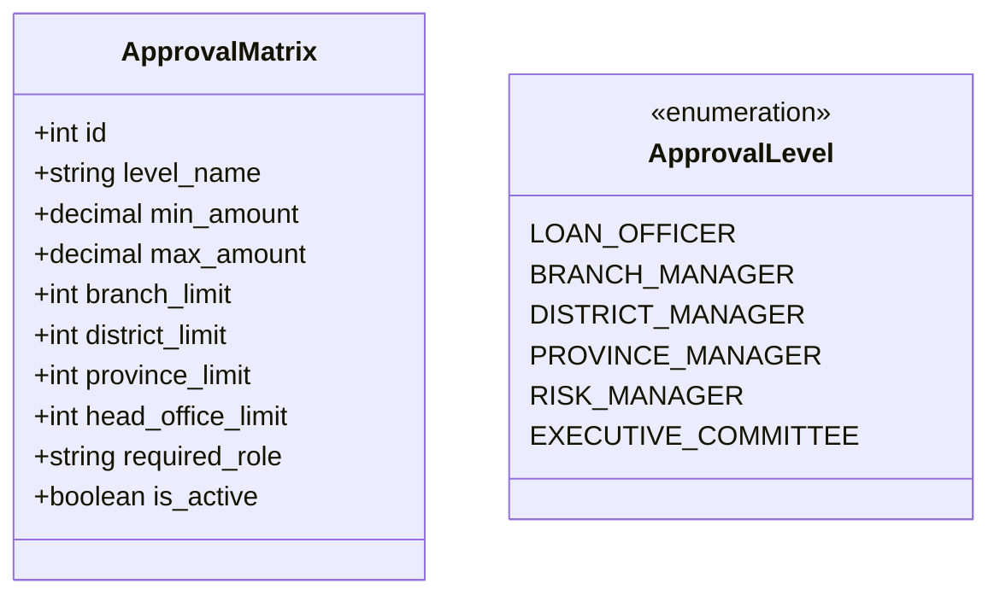

**Approval Hierarchy:**
```
Loan Officer → Branch Manager → District Manager → Province Manager → Risk Manager → Executive Committee
```

**Configuration Options:**
| Level | Branch Limit | District Limit | Province Limit | HO Limit |
|-------|-------------|----------------|----------------|----------|
| Loan Officer | Defined | N/A | N/A | N/A |
| Branch Manager | Defined | N/A | N/A | N/A |
| District Manager | Unlimited | Defined | N/A | N/A |
| Province Manager | Unlimited | Unlimited | Defined | N/A |
| Risk Manager | Unlimited | Unlimited | Unlimited | Defined |
| Executive Committee | Unlimited | Unlimited | Unlimited | Unlimited |

**Key Deliverables:**
- Approval Matrix table
- Workflow integration
- Approval dashboard

---

## Phase 4: Vehicle Ownership & Documentation

### Feature Group 8: Vehicle Ownership Verification

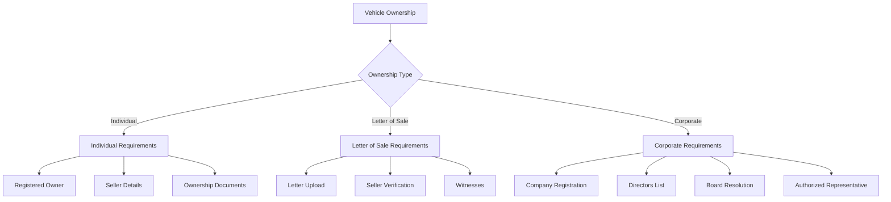

**Ownership Types & Requirements:**

| Type | Required Documents | Verification |
|------|-------------------|--------------|
| Individual | NRC, Ownership Docs | Owner = Client |
| Letter of Sale | Letter, Seller NRC, Witnesses | Seller Verification |
| Corporate | Registration, Resolution, Directors | Company Search |

**Key Deliverables:**
- Dynamic ownership forms
- Ownership checklist
- Document verification workflow

---

### Feature Group 9: Vehicle Valuation Module

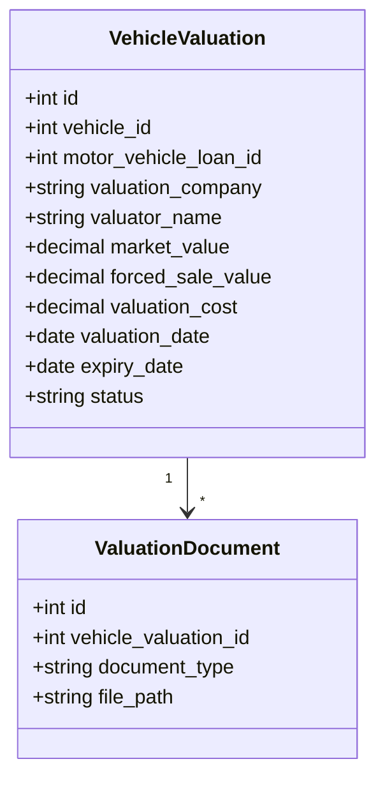

**Key Deliverables:**
- Multiple valuations per vehicle
- Valuation history tracking
- Expiry alerts

---

### Feature Group 10: Vehicle Inspection Module

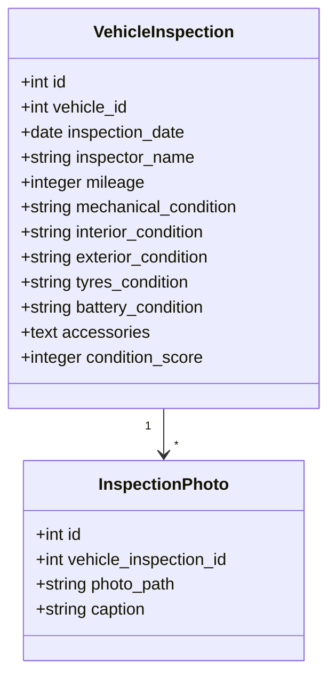

**Inspection Checklist:**
- Mechanical Condition
- Interior Condition
- Exterior Condition
- Tyres
- Battery
- Accessories

**Key Deliverables:**
- Inspection checklist form
- Condition score calculation
- Photo documentation

---

### Feature Group 11: Insurance Management

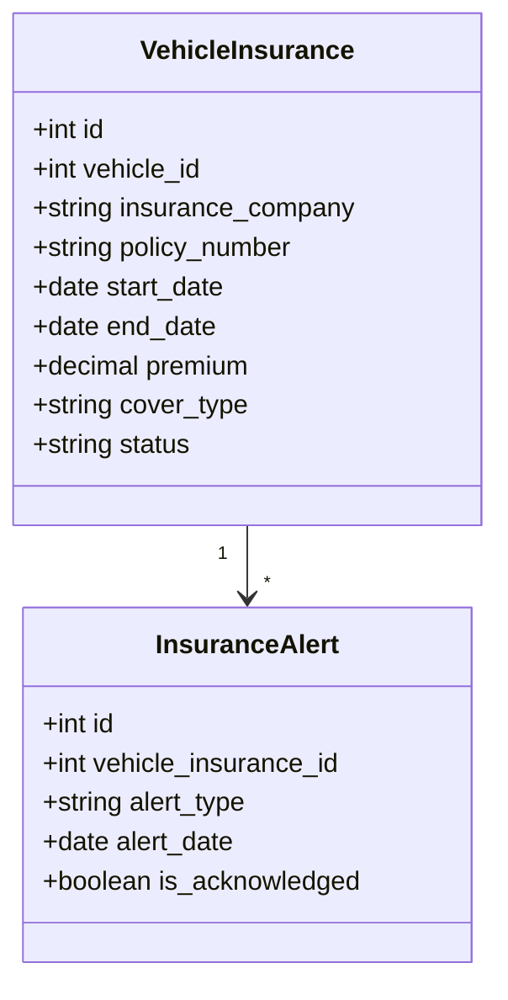

**Alert Types:**
- Expiring Insurance (30 days before)
- Expired Insurance (on expiry date)

**Key Deliverables:**
- Insurance history tracking
- Renewal reminders
- Expiry alerts

---

## Phase 5: Vehicle Intake & Custody Management

### Feature Group 12: Vehicle Intake Module

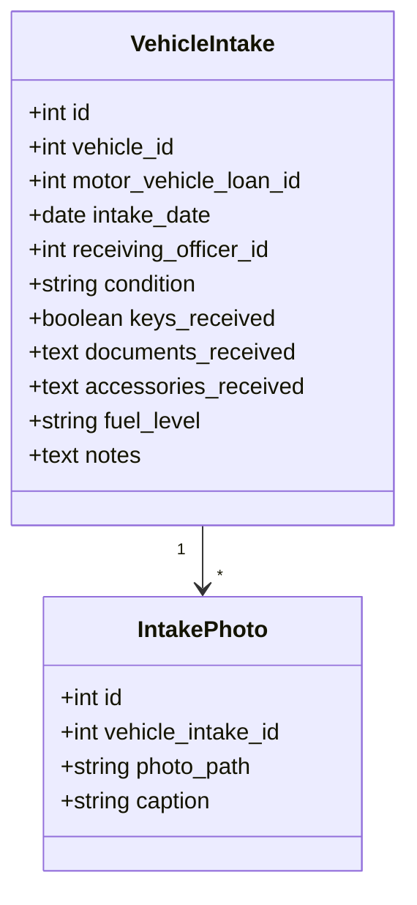

**Intake Checklist:**
| Item | Status |
|------|--------|
| Keys Received | ☐ |
| Registration Book | ☐ |
| Insurance Certificate | ☐ |
| Service Book | ☐ |
| Spare Wheel | ☐ |
| Jack & Tools | ☐ |
| Triangles | ☐ |

**Key Deliverables:**
- Intake checklist form
- Intake report PDF
- Photo documentation

---

### Feature Group 13: Vehicle Custody Register

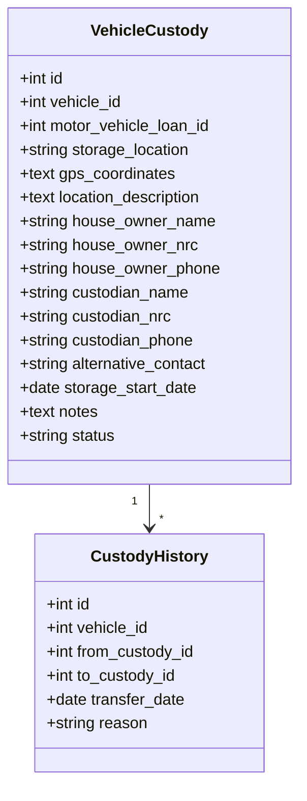

**Key Deliverables:**
- Custody Register
- Current Custody Card
- Custody history tracking

---

### Feature Group 14: Vehicle Movement Register

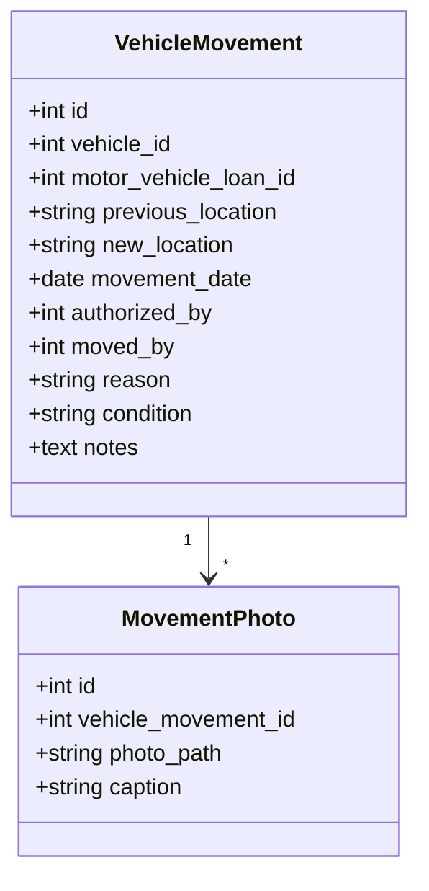

**Movement Workflow:**
```
Request → Authorization → Execution → Verification → Recording
```

**Key Deliverables:**
- Movement history
- Transfer approval workflow
- Movement documentation

---

### Feature Group 15: Weekly Vehicle Roll Call

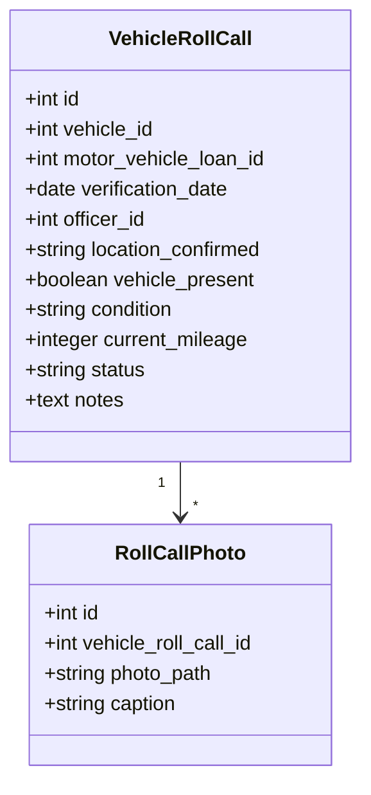

**Roll Call Status:**
| Status | Description |
|--------|-------------|
| Verified | Vehicle present and OK |
| Missing | Vehicle not at location |
| Damaged | Vehicle damaged |
| Relocated | Vehicle moved |

**Key Deliverables:**
- Weekly verification screen
- Missing vehicle report
- Verification dashboard

---

## Phase 6: Media & Document Management

### Feature Group 16: Vehicle Photo Gallery

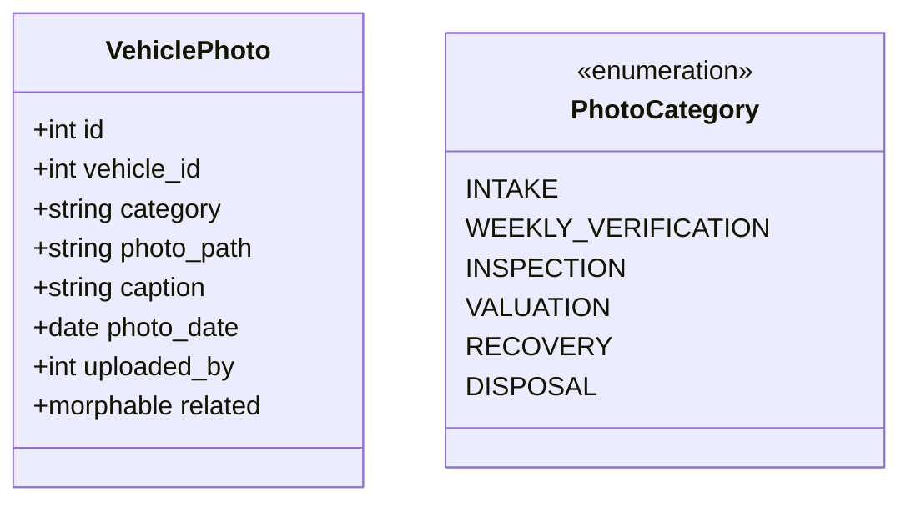

**Photo Categories:**
- Intake Photos
- Weekly Verification
- Inspection
- Valuation
- Recovery
- Disposal

**Key Deliverables:**
- Gallery view
- Timeline view
- Category filtering

---

### Feature Group 17: Document Repository

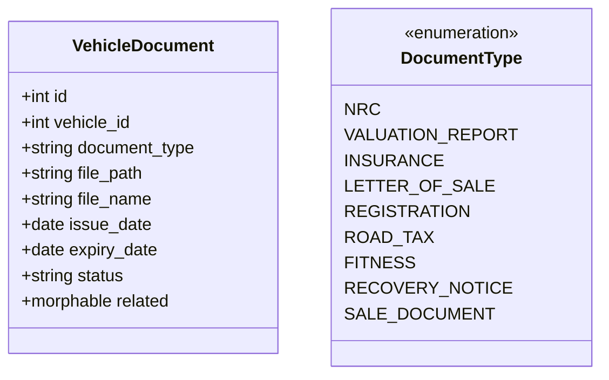

**Document Types:**
| Type | Expiry Tracking |
|------|-----------------|
| NRC | No |
| Valuation Report | Yes |
| Insurance | Yes |
| Letter of Sale | No |
| Registration | No |
| Road Tax | Yes |
| Fitness | Yes |
| Recovery Notice | No |
| Sale Document | No |

**Key Deliverables:**
- Document manager
- Expiry tracker
- Download/view functionality

---

## Phase 7: Repayments, Incentives & Top Ups

### Feature Group 18: Branch Referral Tracking

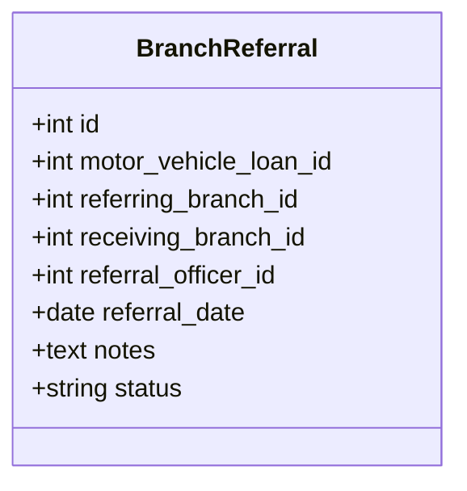

**Key Deliverables:**
- Referral history
- Referral reports

---

### Feature Group 19: Loan Consultant Incentive Tracking

```mermaid
flowchart LR
    A[Loan Disbursed] --> B[Incentive Calculated]
    B --> C[Pending]
    C --> D{Loan Performance}
    D -->|Full Settlement| E[Earned]
    D -->|Default| F[Forfeited]
    E --> G[Payable]
    G --> H[Paid]
```

**Incentive States:**
| State | Description |
|-------|-------------|
| Calculated | Initial calculation |
| Pending | Awaiting settlement |
| Earned | Eligible for payment |
| Payable | Ready for payroll |
| Paid | Transferred to consultant |
| Forfeited | Lost due to default |

**Key Deliverables:**
- Incentive ledger
- Settlement validation
- Payroll export

---

### Feature Group 20: Re-loans & Add-On Loans

```mermaid
classDiagram
    class MotorVehicleLoan {
        +int id
        +int parent_loan_id
        +string loan_type
        +decimal outstanding_balance
    }

    MotorVehicleLoan "1" --> "0..1" MotorVehicleLoan : parent
```

**Loan Types:**
| Type | Description |
|------|-------------|
| New | First loan |
| Top Up | Additional amount |
| Re-loan | Refinancing |

**Validation Rules:**
- Loan performance check
- Current valuation
- Insurance status
- Outstanding balance

**Key Deliverables:**
- Loan chain history
- Eligibility checker

---

## Phase 8: Default & Recovery

### Feature Group 21: Arrears & Default Engine

```mermaid
stateDiagram-v2
    [*] --> Current
    Current --> Due : Payment Due Date
    Due --> Overdue : Grace Period Exceeded
    Overdue --> Arrears : Days Threshold
    Arrears --> Default : Default Threshold
    Default --> Current : Payment Received
    Arrears --> Current : Payment Received
    Overdue --> Current : Payment Received
    Due --> Current : Payment Received
```

**Configurable Rules:**
| Rule | Default | Description |
|------|---------|-------------|
| Grace Period | 5 days | Days after due date |
| Days to Arrears | 30 days | Days to mark arrears |
| Days to Default | 90 days | Days to mark default |
| Penalty Rate | 5% | Late payment penalty |

**Key Deliverables:**
- Default calculator
- Arrears dashboard

---

### Feature Group 22: Recovery Workflow

```mermaid
flowchart LR
    A[Default Triggered] --> B[Reminder]
    B --> C[Demand Notice]
    C --> D[Intention to Sell]
    D --> E[Repossession]
    E --> F[Recovery in Progress]
    F --> G[Recovery Complete]
```

**Recovery Stages:**
| Stage | Description |
|-------|-------------|
| Reminder | Initial reminder |
| Demand Notice | Formal demand |
| Notice of Intention to Sell | Legal notice |
| Repossession | Vehicle seized |
| Recovery In Progress | Active recovery |
| Recovery Complete | Process finished |

**Key Deliverables:**
- Recovery case module
- Officer assignment
- Timeline tracking

---

### Feature Group 23: Notice Management

```mermaid
classDiagram
    class Notice {
        +int id
        +int motor_vehicle_loan_id
        +string notice_type
        +date issue_date
        +date response_deadline
        +string status
        +string delivery_method
        +string pdf_path
    }

    class NoticeType {
        <<enumeration>>
        REMINDER
        DEMAND
        INTENTION_TO_SELL
        FINAL_NOTICE
    }
```

**Delivery Methods:**
- PDF Generation
- SMS Trigger
- Email Trigger

**Key Deliverables:**
- PDF generation
- SMS/Email triggers
- Notice tracking

---

### Feature Group 24: Traffic Offence Management

```mermaid
classDiagram
    class TrafficOffence {
        +int id
        +int vehicle_id
        +string offence_description
        +date offence_date
        +decimal amount
        +string paid_by
        +string status
        +string receipt_number
        +date payment_date
    }
```

**Key Deliverables:**
- Traffic offence ledger
- Outstanding offences report

---

## Phase 9: Disposal & Sale Management

### Feature Group 25: Vehicle Disposal Workflow

```mermaid
flowchart LR
    A[Disposal Approved] --> B[Valuation]
    B --> C[Sale]
    C --> D[Payment]
    D --> E[Release]
    E --> F[Closed]
```

**Disposal Stages:**
| Stage | Description |
|-------|-------------|
| Disposal Approval | Management approval |
| Valuation | Current valuation |
| Sale | Execute sale |
| Payment | Receive payment |
| Release | Release vehicle |
| Closed | Process complete |

**Key Deliverables:**
- Disposal workflow
- Approval records

---

### Feature Group 26: Buyer Management

```mermaid
classDiagram
    class Buyer {
        +int id
        +string full_name
        +string nrc
        +text address
        +string phone
        +string email
        +string company_name
        +string company_registration
    }

    class VehicleSale {
        +int id
        +int vehicle_id
        +int buyer_id
        +decimal sale_price
        +date sale_date
    }

    VehicleSale "*" --> "1" Buyer
```

**Key Deliverables:**
- Buyer profile
- Buyer history

---

### Feature Group 27: Vehicle Purchase Report Generator

```mermaid
classDiagram
    class PurchaseReport {
        +int id
        +int vehicle_sale_id
        +string report_path
        +date generated_at
        +json report_data
    }
```

**Report Contents:**
- Buyer details
- Vehicle details
- Purchase price
- As-Is declaration
- Signatures
- Witnesses
- Sale date

**Key Deliverables:**
- Printable report
- Digital copy storage

---

### Feature Group 28: Sale Proceeds Allocation

```mermaid
flowchart LR
    A[Sale Amount] --> B[Outstanding Principal]
    B --> C[Interest]
    C --> D[Penalties]
    D --> E[Recovery Costs]
    E --> F[Storage Costs]
    F --> G[Legal Costs]
    G --> H[Surplus to Client]
```

**Allocation Order:**
| Priority | Item |
|----------|------|
| 1 | Outstanding Principal |
| 2 | Interest |
| 3 | Penalties |
| 4 | Recovery Costs |
| 5 | Storage Costs |
| 6 | Legal Costs |
| 7 | Surplus (to client) |

**Key Deliverables:**
- Allocation journal
- Disposal financial report

---

## Phase 10: Notifications & Automation

### Feature Group 29: SMS Notification Engine

```mermaid
classDiagram
    class SmsTemplate {
        +int id
        +string name
        +string template
        +string trigger_event
        +boolean is_active
    }

    class SmsLog {
        +int id
        +int client_id
        +string phone_number
        +string message
        +string status
        +timestamp sent_at
    }
```

**SMS Triggers:**
| Event | Template |
|-------|----------|
| Loan Approved | Approval notification |
| Disbursed | Disbursement notification |
| Payment Due | Reminder |
| Overdue | Overdue notice |
| Default | Default notice |
| Recovery Notice | Recovery notification |
| Vehicle Sold | Sale notification |
| Loan Closed | Closure notification |

**Key Deliverables:**
- SMS templates
- SMS logs

---

### Feature Group 30: Management Alerts

```mermaid
classDiagram
    class ManagementAlert {
        +int id
        +string alert_type
        +string title
        +text message
        +int recipient_id
        +boolean is_read
        +timestamp created_at
    }

    class AlertType {
        <<enumeration>>
        VEHICLE_MOVED
        ROLL_CALL_MISSED
        INSURANCE_EXPIRED
        VALUATION_EXPIRED
        DEFAULT_TRIGGERED
        RECOVERY_OVERDUE
        DISPOSAL_COMPLETED
    }
```

**Alert Triggers:**
| Event | Recipients |
|-------|------------|
| Vehicle Moved | Branch Manager |
| Roll Call Missed | District Manager |
| Insurance Expired | Risk Manager |
| Valuation Expired | Branch Manager |
| Default Triggered | Recovery Team |
| Recovery Overdue | Province Manager |
| Disposal Completed | Executive |

**Key Deliverables:**
- Notification center
- Email/SMS alerts

---

## Phase 11: Reporting & Executive Dashboard

### Feature Group 31: Motor Vehicle Portfolio Dashboard

```mermaid
graph LR
    subgraph "KPIs"
        A[Portfolio Value]
        B[Outstanding Balance]
        C[Active Loans]
        D[Arrears]
        E[Defaults]
        F[Recoveries]
        G[Disposals]
        H[Profitability]
    end

    subgraph "Filters"
        I[Province]
        J[District]
        K[Branch]
        L[Officer]
        M[Date Range]
    end
```

**Key Metrics:**
| Metric | Calculation |
|--------|-------------|
| Portfolio Value | Sum of all active loans |
| Outstanding Balance | Remaining principal |
| Active Loans | Count of active loans |
| Arrears | Count in arrears |
| Defaults | Count in default |
| Recoveries | Count in recovery |
| Disposals | Count disposed |
| Profitability | Income - Expenses |

---

### Feature Group 32: Custody Dashboard

```mermaid
graph TB
    subgraph "Custody Overview"
        A[Vehicles in Custody]
        B[By Province]
        C[By District]
        D[By Branch]
    end

    subgraph "Status"
        E[Missing Vehicles]
        F[Verification Compliance]
        G[Storage Occupancy]
    end
```

---

### Feature Group 33: Recovery Dashboard

```mermaid
graph LR
    subgraph "Recovery Metrics"
        A[Recovery Pipeline]
        B[Notices Issued]
        C[Repossessions]
        D[Vehicles Awaiting Sale]
        E[Sale Proceeds]
        F[Recovery Success Rate]
    end
```

---

### Feature Group 34: Profitability Dashboard

```mermaid
graph TB
    subgraph "Income"
        A[Interest Earned]
        B[Fees Earned]
        C[Recovery Income]
        D[Disposal Income]
    end

    subgraph "Expenses"
        E[Recovery Expenses]
        F[Storage Expenses]
    end

    subgraph "Net"
        G[Net Profitability]
    end

    A --> G
    B --> G
    C --> G
    D --> G
    E --> G
    F --> G
```

---

## Phase 12: Administration & Configuration

### Feature Group 35: Motor Vehicle Settings Module

```mermaid
classDiagram
    class MvSetting {
        +int id
        +string key
        +string value
        +string type
        +date effective_from
        +date effective_to
        +int version
    }

    class SettingVersion {
        +int id
        +int setting_id
        +int version_number
        +json configuration
        +date effective_from
        +int approved_by
    }
```

**Configurable Items:**
| Category | Items |
|----------|-------|
| Interest | Rates, Types, Bands |
| Loan | Bands, Tenure |
| Fees | Service, Processing, Insurance |
| Penalties | Rates, Thresholds |
| Recovery | Timelines, Charges |
| Notices | Periods, Templates |
| Approval | Limits, Hierarchy |
| Incentives | Percentages, Rules |
| Storage | Verification frequency |

**Key Deliverables:**
- Settings UI
- Version history
- Effective date management

---

### Feature Group 36: Motor Vehicle Audit & History Viewer

```mermaid
flowchart LR
    subgraph "Complete Timeline"
        A[Client] --> B[Staff]
        B --> C[Branch]
        C --> D[Assessor]
        D --> E[District]
        E --> F[Province]
        F --> G[KYC]
        G --> H[Valuation]
        H --> I[Approval]
        I --> J[Intake]
        J --> K[Storage]
        K --> L[Custodian]
        L --> M[Weekly Verification]
        M --> N[Disbursement]
        N --> O[Repayment]
        O --> P[Default/Recovery]
        P --> Q[Disposal]
        Q --> R[Buyer]
        R --> S[Closure]
    end
```

**Timeline Components:**
| Component | Data |
|-----------|------|
| Client | KYC, Documents |
| Staff | Consultant, Assessor |
| Branch | Originating, Current |
| Location | District, Province |
| Verification | KYC, PEP, Ownership |
| Vehicle | Valuation, Inspection |
| Financial | Approval, Disbursement, Repayment |
| Custody | Storage, Movement, Roll Call |
| Recovery | Default, Recovery, Disposal |
| Closure | Buyer, Proceeds, Final |

**Key Deliverables:**
- Complete lifecycle timeline
- Expandable event history
- Linked documents/photos
- Officer audit trail

---

## Implementation Roadmap

```mermaid
gantt
    title Motor Vehicle Loan Lifecycle Implementation
    dateFormat  YYYY-MM-DD
    section Sprint 1: Foundation
    FG1: Master Record        :a1, 2026-09-01, 5d
    FG2: Workflow Engine      :a2, after a1, 5d
    FG3: Audit Trail          :a3, after a2, 3d
    section Sprint 2: Compliance
    FG4: Client KYC           :b1, after a3, 5d
    FG5: PEP & Sanctions      :b2, after b1, 3d
    FG6: Product Config       :b3, after b2, 5d
    FG7: Approval Matrix      :b4, after b3, 3d
    section Sprint 3: Vehicle Ops
    FG8: Ownership Verify     :c1, after b4, 5d
    FG9: Valuation            :c2, after c1, 3d
    FG10: Inspection          :c3, after c2, 3d
    FG11: Insurance           :c4, after c3, 3d
    FG12: Vehicle Intake      :c5, after c4, 3d
    FG13: Custody Register    :c6, after c5, 3d
    FG14: Movement Register   :c7, after c6, 3d
    FG15: Weekly Roll Call    :c8, after c7, 3d
    FG16: Photo Gallery       :c9, after c8, 3d
    FG17: Document Repository :c10, after c9, 3d
    section Sprint 4: Loan Ops
    FG18: Branch Referrals    :d1, after c10, 3d
    FG19: Consultant Incent   :d2, after d1, 3d
    FG20: Re-loans & Top-Ups  :d3, after d2, 3d
    FG21: Arrears Engine      :d4, after d3, 5d
    FG22: Recovery Workflow   :d5, after d4, 5d
    FG23: Notice Management   :d6, after d5, 3d
    FG24: Traffic Offences    :d7, after d6, 3d
    section Sprint 5: Disposal & Reports
    FG25: Disposal Workflow   :e1, after d7, 5d
    FG26: Buyer Management    :e2, after e1, 3d
    FG27: Purchase Reports    :e3, after e2, 3d
    FG28: Proceeds Allocation :e4, after e3, 3d
    FG29: SMS Engine          :e5, after e4, 5d
    FG30: Management Alerts   :e6, after e5, 3d
    FG31: Portfolio Dashboard :e7, after e6, 5d
    FG32: Custody Dashboard   :e8, after e7, 3d
    FG33: Recovery Dashboard  :e9, after e8, 3d
    FG34: Profitability Dash  :e10, after e9, 3d
    FG35: Settings Module     :e11, after e10, 5d
    FG36: Audit History Viewer :e12, after e11, 5d
```

---

## Feature Group Summary Table

| Phase | FG # | Name | Status | Sprint |
|-------|------|------|--------|--------|
| 1 | 1 | Master Record | ✅ Complete | 1 |
| 1 | 2 | Workflow Engine | ✅ Complete | 1 |
| 1 | 3 | Audit Trail | ✅ Complete | 1 |
| 2 | 4 | Client KYC | ✅ Complete | 2 |
| 2 | 5 | PEP & Sanctions | ✅ Complete | 2 |
| 3 | 6 | Product Configuration | ✅ Complete | 2 |
| 3 | 7 | Approval Matrix | ✅ Complete | 2 |
| 4 | 8 | Ownership Verification | ✅ Complete | 3 |
| 4 | 9 | Valuation | ✅ Complete | 3 |
| 4 | 10 | Inspection | ✅ Complete | 3 |
| 4 | 11 | Insurance | ✅ Complete | 3 |
| 5 | 12 | Vehicle Intake | ✅ Complete | 3 |
| 5 | 13 | Custody Register | ✅ Complete | 3 |
| 5 | 14 | Movement Register | ✅ Complete | 3 |
| 5 | 15 | Weekly Roll Call | ✅ Complete | 3 |
| 6 | 16 | Photo Gallery | ✅ Complete | 3 |
| 6 | 17 | Document Repository | ✅ Complete | 3 |
| 7 | 18 | Branch Referrals | ⏳ Pending | 4 |
| 7 | 19 | Consultant Incentives | ⏳ Pending | 4 |
| 7 | 20 | Re-loans & Top-Ups | ⏳ Pending | 4 |
| 8 | 21 | Arrears Engine | ⏳ Pending | 4 |
| 8 | 22 | Recovery Workflow | ⏳ Pending | 4 |
| 8 | 23 | Notice Management | ⏳ Pending | 4 |
| 8 | 24 | Traffic Offences | ⏳ Pending | 4 |
| 9 | 2